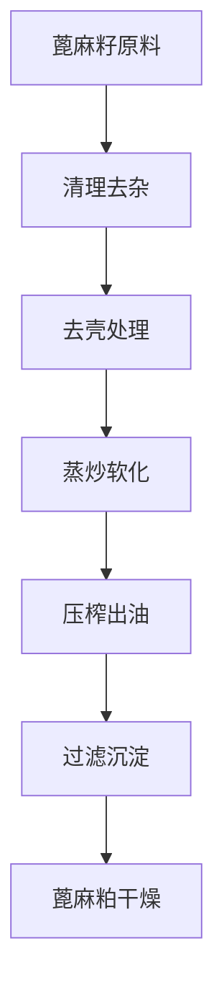
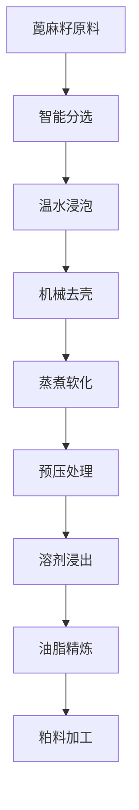

# 蓖麻籽（蓖麻油）解决方案

## 概述

蓖麻籽是蓖麻植物的种子，富含特殊油脂，可提取蓖麻油。蓖麻油具有独特的理化性质，主要应用于工业领域，如润滑油、涂料、医药等。山东盛世赫程机械有限公司提供专业蓖麻籽压榨解决方案，满足不同规模的生产需求。

## 蓖麻籽特性

### 📊 基本参数
- **含油率**: 45-55%
- **蛋白质含量**: 18-22%
- **主要成分**: 蓖麻油酸（80-90%）
- **适宜温度**: 压榨温度控制在80-100℃

### 🌱 生长特性
- **生长周期**: 150-180天
- **适宜气候**: 温暖、湿润气候
- **土壤要求**: 肥沃、排水良好土壤
- **年产量**: 全球蓖麻产量约200万吨

## 加工工艺

### 传统工艺流程

### 现代工艺流程

## 设备推荐

### 小型加工（日处理2-10吨）
- **300/325系列专用压榨机**
- 蓖麻籽预处理设备
- 简易精炼系统
- 投资成本：50-150万元

### 中型加工（日处理10-50吨）
- **355/400系列压榨机**
- 自动化预处理生产线
- 连续精炼设备
- 投资成本：300-800万元

### 大型加工（日处理50吨以上）
- **425/480系列压榨机**
- 全自动生产线
- 智能化管理系统
- 投资成本：1500万元以上

## 技术优势

### 🎯 精准控制
- 温度控制：±2℃精度
- 压力控制：智能调节
- 炒制时间：最佳工艺参数

### 💧 油质保证
- 热榨工艺突出特性
- 物理压榨保证纯净
- 出油率高达50-52%

### 🔄 连续生产
- 自动化生产流程
- 连续压榨工艺
- 智能质量监控

## 产品应用

### 🏭 工业应用
- 蓖麻油：优质工业油
- 润滑油：机械润滑
- 涂料原料：油漆生产

### 🥛 副产品
- 蓖麻粕：优质蛋白饲料
- 蓖麻壳：燃料或饲料
- 蓖麻蛋白：工业添加剂

### 💊 功能性产品
- 蓖麻油酸
- 蓖麻多酚
- 蓖麻磷脂

## 市场分析

### 📈 发展趋势
- 工业油需求增长
- 绿色工业原料扩大
- 出口贸易机会增加

### 🎯 目标市场
- 工业油加工企业
- 涂料生产企业
- 润滑油企业
- 出口贸易企业

## 成功案例

### 印度某蓖麻油加工厂
- **设备配置**: 400系列压榨机×6台
- **日处理量**: 80吨蓖麻籽
- **出油率**: 51%
- **年产量**: 8000吨蓖麻油
- **市场覆盖**: 全球多个国家

### 中国某蓖麻油企业
- **设备配置**: 355系列专用机×4台
- **日处理量**: 30吨蓖麻籽
- **产品质量**: 工业标准
- **品牌建设**: 国际知名品牌
- **年销售额**: 6000万元

### 巴西某高端蓖麻油品牌
- **设备配置**: 325系列专用机×8台
- **日处理量**: 20吨精品蓖麻籽
- **产品质量**: 国际工业标准
- **市场定位**: 高端工业油
- **出口市场**: 欧洲、美洲

## 质量标准

### 🏆 产品质量标准
- 符合工业油标准
- 符合出口工业标准
- 符合安全运输标准

### 🔍 检测项目
- 酸价检测
- 粘度检测
- 色泽透明度检测
- 重金属含量检测
- 杂质含量检测

## 可持续发展

### 🌱 环保生产
- 废弃物循环利用
- 节能减排工艺
- 绿色生产标准

### 🔄 资源利用
- 副产品综合利用
- 产业链延伸
- 循环经济模式

### 🌍 社会责任
- 支持农民增收
- 保障生产安全
- 保护生态环境

## 联系我们

如果您对蓖麻籽压榨解决方案感兴趣，请联系我们的技术团队：

- 📞 **咨询热线**: +86 19906365856
- 📧 **邮箱**: sales@oil-pressing-machine.com
- 📍 **地址**: 山东省潍坊市青州市开发区益能街5888号

我们提供免费的技术咨询、样品测试和实地考察服务，为您提供最适合的蓖麻籽压榨解决方案。