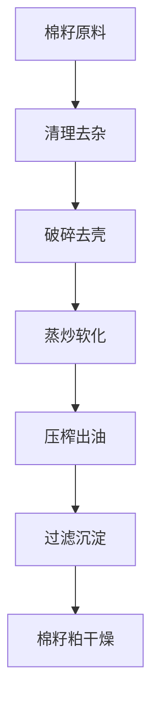
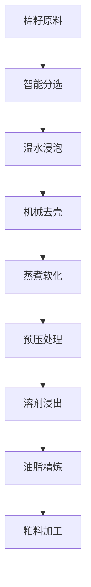

# 棉籽（棉籽油）解决方案

## 概述

棉籽是重要的油料作物，棉籽油具有广泛的工业和食用应用价值。山东盛世赫程机械有限公司提供专业的棉籽压榨解决方案，从小型作坊到大型工厂的全套设备和服务。

## 棉籽特性

### 📊 基本参数
- **含油率**: 35-45%
- **蛋白质含量**: 20-25%
- **主要脂肪酸**: 亚油酸（45-55%）、棕榈酸（20-25%）、油酸（15-20%）
- **适宜温度**: 压榨温度控制在60-80℃

### 🌱 生长特性
- **生长周期**: 150-180天
- **适宜气候**: 温暖、干燥地区
- **土壤要求**: 肥沃、排水良好的土壤
- **年产量**: 全球年产量超过5000万吨

## 加工工艺

### 传统工艺流程

### 现代工艺流程

## 设备推荐

### 小型加工（日处理5-15吨）
- **355/400系列压榨机**
- 棉籽预处理生产线
- 简易精炼设备
- 投资成本：150-350万元

### 中型加工（日处理15-40吨）
- **425/480系列压榨机**
- 完整预处理生产线
- 连续精炼设备
- 投资成本：600-1200万元

### 大型加工（日处理40吨以上）
- **500系列大型压榨机**
- 全自动生产线
- 智能化管理系统
- 投资成本：1800万元以上

## 技术优势

### 🎯 精准控制
- 温度控制：±2℃精度
- 压力控制：智能调节
- 湿度控制：最佳含水量

### 💧 油质保证
- 专业脱毒工艺
- 物理压榨无化学残留
- 出油率行业领先（38-42%）

### 🔄 连续生产
- 24小时不间断运行
- 自动化进料出料
- 智能故障报警

## 产品应用

### 🍳 食用油
- 棉籽油：经脱毒处理后食用
- 调和油：与其他油脂混合
- 特种油：工业用油

### 🥛 副产品
- 棉籽粕：优质蛋白饲料
- 棉籽蛋白：食品添加剂
- 棉籽磷脂：功能性成分

### 🏭 工业应用
- 润滑油基础油
- 生物柴油原料
- 化工原料

## 市场分析

### 📈 发展趋势
- 工业用油需求增长
- 生物柴油市场扩大
- 副产品综合利用提升

### 🎯 目标市场
- 食用油加工企业
- 饲料加工企业
- 化工原料企业
- 生物柴油生产企业

## 成功案例

### 山东某大型棉籽油加工厂
- **设备配置**: 480系列压榨机×8台
- **日处理量**: 100吨棉籽
- **出油率**: 40%
- **年产量**: 1.2万吨棉籽油
- **市场覆盖**: 全国20个省市

### 河南某现代化棉籽油企业
- **设备配置**: 500系列压榨机×6台
- **日处理量**: 80吨棉籽
- **产品质量**: 符合国家一级标准
- **副产品利用**: 棉籽粕年产量8万吨
- **经济效益**: 年销售额2亿元

### 新疆某棉籽油加工企业
- **设备配置**: 400系列专用机×5台
- **日处理量**: 50吨棉籽
- **产品质量**: 有机食品认证
- **品牌定位**: 高端食用棉籽油
- **市场定位**: 西北地区市场

## 质量标准

### 🏆 产品质量标准
- 符合国家棉籽油标准（GB 1538）
- 符合食品安全标准
- 符合出口食品标准
- 符合工业用油标准

### 🔍 检测项目
- 酸价检测
- 过氧化值检测
- 色泽透明度检测
- 重金属含量检测
- 黄曲霉毒素检测
- 棉酚含量检测

## 可持续发展

### 🌱 环保生产
- 废弃物循环利用
- 节能减排工艺
- 绿色生产标准

### 🔄 资源利用
- 副产品综合利用
- 产业链延伸
- 循环经济模式

### 🌍 社会责任
- 支持棉农增收
- 保障食品安全
- 保护生态环境

## 联系我们

如果您对棉籽压榨解决方案感兴趣，请联系我们的技术团队：

- 📞 **咨询热线**: +86 19906365856
- 📧 **邮箱**: sales@oil-pressing-machine.com
- 📍 **地址**: 山东省潍坊市青州市开发区益能街5888号

我们提供免费的技术咨询、样品测试和实地考察服务，为您提供最适合的棉籽压榨解决方案。