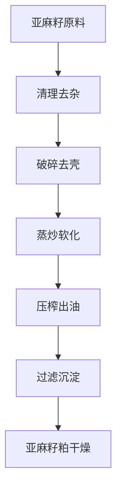
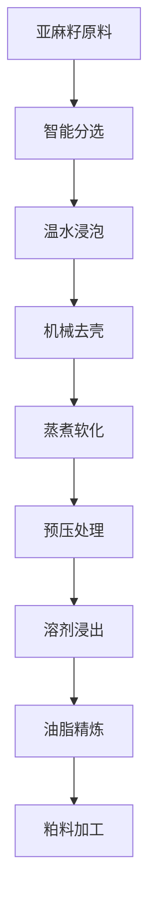

# 亚麻籽（亚麻籽油）解决方案

## 概述

亚麻籽是重要的油料作物，亚麻籽油具有独特的营养价值和应用价值。山东盛世赫程机械有限公司提供专业的亚麻籽压榨解决方案，从小型作坊到大型工厂的全套设备和服务。

## 亚麻籽特性

### 📊 基本参数
- **含油率**: 35-45%
- **蛋白质含量**: 18-22%
- **主要脂肪酸**: 亚油酸（15-30%）、α-亚麻酸（45-65%）、油酸（15-20%)
- **适宜温度**: 压榨温度控制在60-80℃

### 🌱 生长特性
- **生长周期**: 90-120天
- **适宜气候**: 凉爽、湿润地区
- **土壤要求**: 肥沃、中性土壤
- **年产量**: 全球年产量超过300万吨

## 加工工艺

### 传统工艺流程

### 现代工艺流程

## 设备推荐

### 小型加工（日处理2-10吨）
- **300/325系列专用压榨机**
- 亚麻籽预处理设备
- 简易精炼系统
- 投资成本：50-150万元

### 中型加工（日处理10-30吨）
- **355/400系列压榨机**
- 自动化预处理生产线
- 连续精炼设备
- 投资成本：200-600万元

### 大型加工（日处理30吨以上）
- **425/480系列压榨机**
- 全自动生产线
- 智能化管理系统
- 投资成本：1000万元以上

## 技术优势

### 🎯 精准控制
- 温度控制：±2℃精度
- 压力控制：智能调节
- 湿度控制：最佳含水量

### 💧 油质保证
- 低温工艺保留营养
- 物理压榨无化学残留
- 出油率高达38-42%

### 🔄 连续生产
- 24小时不间断运行
- 自动化进料出料
- 智能故障报警

## 产品应用

### 🍳 食用油
- 亚麻籽油：主要食用油品种
- 调和油：与其他油脂混合
- 特种油：高端营养油

### 💊 保健品
- 亚麻籽油：营养补充剂
- 调和油：与其他油脂混合
- 特种油：高端营养油

### 🏭 工业用油
- 亚麻籽油：基础油原料
- 调和油：与其他油脂混合
- 特种油：高端营养油

## 市场分析

### 📈 发展趋势
- 健康食用油、Ω-3补充剂需求增长
- 高端亚麻籽油市场扩大
- 出口贸易机会增加

### 🎯 目标市场
- 食用油加工企业
- 食品加工企业
- 保健品企业
- 出口贸易企业

## 成功案例

### 山东某大型亚麻籽油加工厂
- **设备配置**: 400系列压榨机×6台
- **日处理量**: 50吨亚麻籽
- **出油率**: 38
- **年产量**: 6000吨亚麻籽油
- **市场覆盖**: 全国20个省市

### 河南某专业亚麻籽油企业
- **设备配置**: 355系列专用机×4台
- **日处理量**: 25吨亚麻籽
- **产品质量**: 国家一级标准
- **品牌建设**: 区域知名品牌
- **年销售额**: 2000万元

### 浙江某高端亚麻籽油品牌
- **设备配置**: 325系列专用机×5台
- **日处理量**: 15吨精品亚麻籽
- **产品质量**: 有机食品认证
- **市场定位**: 高端有机食用油
- **出口市场**: 欧洲、美国

## 质量标准

### 🏆 产品质量标准
- 符合国家亚麻籽油标准
- 符合食品安全标准
- 符合出口食品标准
- 符合有机食品认证

### 🔍 检测项目
- 酸价检测
- 过氧化值检测
- 色泽透明度检测
- 重金属含量检测
- 农药残留检测

## 可持续发展

### 🌱 环保生产
- 废弃物循环利用
- 节能减排工艺
- 绿色生产标准

### 🔄 资源利用
- 副产品综合利用
- 产业链延伸
- 循环经济模式

### 🌍 社会责任
- 支持农民增收
- 保障食品安全
- 保护生态环境

## 联系我们

如果您对亚麻籽压榨解决方案感兴趣，请联系我们的技术团队：

- 📞 **咨询热线**: +86 19906365856
- 📧 **邮箱**: sales@oil-pressing-machine.com
- 📍 **地址**: 山东省潍坊市青州市开发区益能街5888号

我们提供免费的技术咨询、样品测试和实地考察服务，为您提供最适合的亚麻籽压榨解决方案。