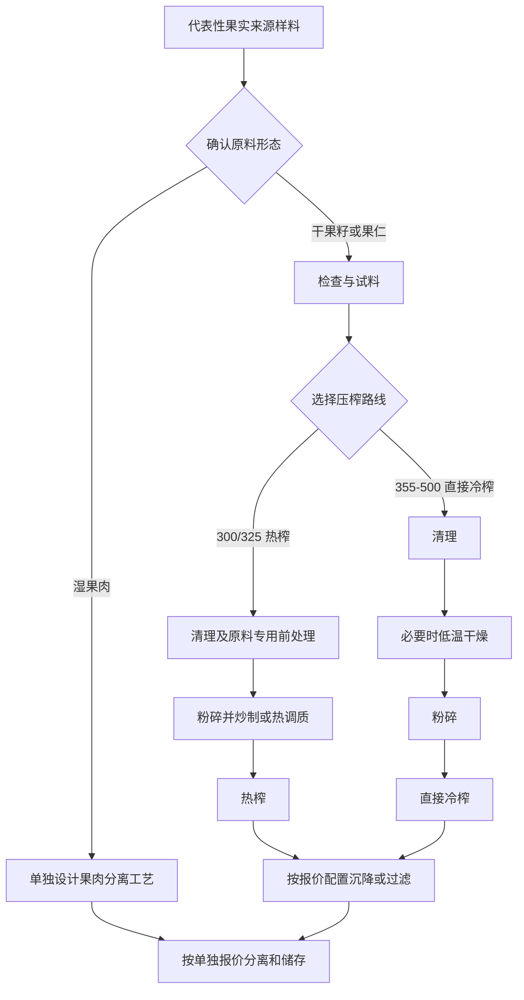

# 果实类油料解决方案

## 采购范围

“果实油”可能来自湿果肉、干燥果籽或硬壳果核，三类原料不能共用一套默认工艺。水分、残留果肉和糖分、成熟度、发酵与氧化、去核脱壳、天然受控成分，以及食品、化妆品或工业用途，均应在压榨机和生产线报价前确认。

本页不预填含油率、出油率、单批装料、产能、投资额、运行时长或成品等级。有效厂家报价必须写明准确原料形态、样料条件、前处理责任、设备清单、验收方法和后续工段边界。

## 原料差异

| 果实来源原料 | 需要确认的差异 | 工艺边界 |
| --- | --- | --- |
| 鳄梨等含油湿果肉 | 品种、成熟度、果肉与果核分离、水分、储存时间、酶变及目标分离方式 | 打浆、调和、离心或其他湿法分离属于独立工艺；不能默认把湿果肉直接投入种籽或果仁液压压榨机 |
| 葡萄籽等酿酒或果汁副产种籽 | 残留果皮果肉、糖分、发酵历史、清洗、干燥、储存时间和细粉 | 用代表性干籽样料确认清理、必要时低温干燥、粉碎、直接冷榨和过滤负荷 |
| 南瓜籽与西瓜籽 | 整籽或籽仁、壳仁比例、食用等级、水分、既有焙炒和风味目标 | 明确脱壳由采购方完成还是列入供货，并根据产品目标和试料选择热榨或冷榨 |
| 桃仁、杏仁及其他核仁 | 去核去壳、核仁身份、甜苦品种、破损、储存和天然受控成分 | 不预设食品或化妆品适用性；脱壳、检测、处理和目的地合规责任需书面分配 |

果肉、果籽和果核的结果不能互相替代。每个品种、原料形态、供应商和前处理状态都需要独立试料依据。

## 机型路线与前处理边界

以下机型规则只适用于已准备好的干燥果籽或果仁，不适用于未经处理的湿果肉。

| 路线 | 机型 | 必须明确的工艺顺序 | 使用边界 |
| --- | --- | --- | --- |
| 热榨 | 300/325 系列 | 清理分选，按需去核、脱壳或仁壳分离，粉碎，炒制或热调质后压榨 | 侧重热处理或熟香产品；物料状态和热处理程序由试料确定 |
| 直接冷榨 | 355-500 系列 | 清理，样料确有需要时低温干燥，粉碎后直接冷榨 | 粉碎与压榨之间不预设炒制、蒸炒或蒸煮；适用性和机型由准备后的样料确认 |

```mermaid
flowchart TD
    A[代表性果实来源样料] --> B{确认原料形态}
    B -->|湿果肉| C[单独设计果肉分离工艺]
    B -->|干果籽或果仁| D[检查与试料]
    D --> E{选择压榨路线}
    E -->|300/325 热榨| F[清理及原料专用前处理]
    F --> G[粉碎并炒制或热调质]
    G --> H[热榨]
    E -->|355-500 直接冷榨| I[清理]
    I --> J[必要时低温干燥]
    J --> K[粉碎]
    K --> L[直接冷榨]
    H --> M[按报价配置沉降或过滤]
    L --> M
    C --> N[按单独报价分离和储存]
    M --> N
```

清洗、打浆、去核、脱壳、低温干燥、炒制、压榨、离心、过滤、精炼、冷藏、灌装、公用工程和废弃物处理均为独立范围项。双方签字的设备清单和接口表决定每一步由谁提供。

## 样料条件与试验记录

寄样前应书面确认样料数量、保鲜或干燥要求、包装、运输温度（如适用）、报关、试料费用、清洗、耗材和退回或处置安排。

样料资料至少说明：

- 品种、产地、供应商、采收或加工批次、成熟度或生产日期和储存历史
- 整果、果肉、湿籽、干籽、带壳果核或净果仁形态
- 水分、残留果肉或糖分、壳占比、异物、破损、发酵或酸败状态，以及如有的实验室含油率
- 已完成的清洗、打浆、干燥、脱壳、炒制、稳定化或化学处理
- 油品用途、饼渣用途、热榨或冷榨路线、风味、过滤、分离、精炼、储存和包装目标
- 实验室方法、过敏原、安全资料和目的市场限制

试料报告应记录实际前处理、净投入、水分、粒度、温度过程、压力程序、完整周期、分离油或液体、饼或残渣、损耗、过滤口径、清洗观察和实验室留样。报价产能应按包含的完整工艺及瓶颈计算；若包含果肉准备或干燥，也应计入整线节拍。

## 厂家报价设备清单

果实油报价可根据原料形态选择：

- 原料接收、检验、清洗、分选和异物去除
- 经单独设计的打浆、去核、种籽回收或果仁脱壳分离设备
- 355-500 冷榨路线在样料需要时配置的低温干燥设备
- 按果籽或果仁试料选择的粉碎设备
- 300/325 热榨路线所需炒制或热调质设备
- 用于已清理、必要时低温干燥并粉碎的果籽或果仁的 355-500 直接冷榨设备
- 仅在湿料项目中单独明确的果肉分离、离心或沉降设备
- 集油、沉降、输送、过滤及保护性或控温储油设备
- 饼、果肉、废水、果核、壳和副产品处理接口
- 电控柜、防护、控制、说明书、图纸和约定备件
- 另行报价的精炼、灌装、制冷、实验室、公用工程或包装系统

报价应明确区分完整工艺生产线与单机压榨供货。

## 报价输入与价格口径

为了获得本地化厂家价格和可比采购报价，请提供：

- 准确品种、原料形态、供应状态和同线计划产品
- 果肉分离、热榨或直接冷榨路线
- 目标产能、批次或班次计划、季节供应、清洗和换料方式
- 项目国家与城市、布局、进场、地面承载、吊装、排水和储存条件
- 电力、冷热源、水、压缩空气、通风、废水处理和冷藏条件
- 接触材质、过滤或分离口径、储油、精炼、灌装、包装和副产品边界
- 采购方产品规格、实验室方法、文件语言、目的地合规清单和验收计划
- 币种、贸易术语、交货点、出口包装、运保、税费、调试、培训和备件要求
- 需要比较不同生产线范围时的预算区间

厂家报价应分列基础设备、可选前处理和后续系统、排除项、公用工程、商务条款、交付口径、文件、FAT/SAT 和售后。投资测算应使用采购方当前的原料、能耗、人工、物流、税费、融资、废弃物和产品价格。

## FAT 与 SAT

### FAT 工厂验收

书面 FAT 协议必须明确原料形态和样料条件。果籽或果仁压榨应检查前处理、设备身份、报价内安全功能、净投入、完整周期、温度过程、油饼收集、过滤、清洗、实验室留样和文件；湿果肉项目应采用单独的物料平衡和分离协议。试料、耗材、第三方检测和重复测试的费用应在 FAT 前分配清楚。

### SAT 现场验收

SAT 应核对现场就绪、公用工程、卫生与排水、安装接口、现场原料一致性、操作人员参与、完整工艺运行、取样、实验室对比、清洗、培训记录和问题关闭。差旅、签证、当地人工、吊装、住宿、耗材、检测和再次到场只有书面列项并计价后才属于供货服务。

## 合规与售后书面确认

采购方应说明食品、化妆品、保健品、饲料或工业用途及销售国家。合同应分配产品与工厂标准、机械和电气安全、食品接触材质、过敏原和交叉污染、核仁天然受控成分、废水、废弃物、标签、实验室检测以及进出口文件的责任。

适用认证与标准必须按项目逐项核验，设备清单本身不附带国家、出口、有机、食品或化妆品合规结论。证书和报告应核对签约主体、工厂、机型、工艺、产品、有效状态和目的市场；设备配置本身不能证明成品油合规。

售后条款应写明质保起算与范围、排除项、支持渠道和响应时段、远程与现场边界、人工和差旅费用、配件识别、价格与交期确认、耗材、说明书、培训和维护责任。未写入合同的服务不视为包含。

## 联系我们

如需果实油生产线采购、设备选型、厂家价格或书面项目报价，请联系技术与商务团队：

- **电话**: +86 19906365856
- **邮箱**: gavin@oil-pressing-machine.com
- **地址**: 山东省潍坊市青州市开发区益能街5888号

## 相关链接

- [解决方案总览](/zh/solutions/)
- [鳄梨（牛油果油）解决方案](/zh/solutions/avocado)
- [葡萄籽（葡萄籽油）解决方案](/zh/solutions/grape-seed)
- [南瓜籽（南瓜籽油）解决方案](/zh/solutions/pumpkin-seed)
- [400系列液压榨油机](/zh/products/400)
- [联系我们获取方案](/zh/contact/)
- [English Page](/en/solutions/fruits)

## 获取价格/报价

提交原料形态、样料记录、拟定工艺、目标生产安排、现场公用工程、目的地要求、设备边界和商务条款后，厂家报价可分别列出果肉、果籽或果仁前处理、压榨、过滤、后续选配、交付、验收和售后费用。

- [获取价格/报价](/zh/contact/)

<!-- quote-cta -->
