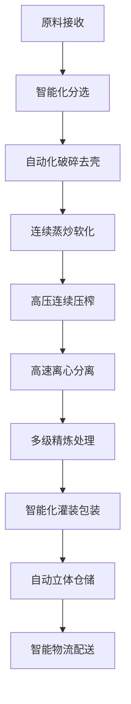

# 大型现代化工厂解决方案

## 概述

大型现代化工厂解决方案专为大型企业、知名品牌和出口加工企业设计，提供全自动化、智能化的油料加工生产线，帮助您构建行业领先的现代化油料加工基地。山东盛世赫程机械有限公司提供从工厂规划到全球营销的完整产业链解决方案。

## 适用场景

### 🏭 大型企业
- **目标用户**: 国有企业、上市公司
- **日处理量**: 50-200吨
- **投资预算**: 2000-8000万元

### 🏢 知名品牌
- **目标用户**: 全国性知名油品品牌
- **日处理量**: 30-150吨
- **投资预算**: 1500-6000万元

### 🌐 出口加工
- **目标用户**: 出口贸易企业、跨国公司
- **日处理量**: 40-180吨
- **投资预算**: 1800-7000万元

## 主要设备配置

### 标准配置（2000-4000万元）
- **425/480系列榨油机** × 5-10台
- 全自动预处理生产线
- 连续精炼设备系统
- 智能化仓储物流系统

### 增强配置（4000-7000万元）
- **480/500系列智能榨油机** × 8-15台
- 全自动化生产线集群
- 智能化管理系统平台
- 品牌包装自动化生产线

### 旗舰配置（7000-10000万元）
- **500系列超级榨油机** × 10-20台
- 全智能化工厂系统
- 工业互联网平台
- 全球供应链管理系统

## 加工工艺流程

## 技术特点

### 🤖 全智能化
- 工业互联网平台
- AI质量控制系统
- 智能运维管理系统
- 大数据分析平台

### ⚡ 超高效率
- 大规模连续生产
- 自动化物流系统
- 能源优化管理系统
- 生产效率最大化

### 🎯 品质卓越
- 多级精炼工艺
- 在线质量检测
- 产品追溯系统
- 国际质量标准

## 适用油料作物

### 🌾 主要粮油作物
- **大豆**: 大规模压榨，出口级产品
- **花生**: 高端花生油，品牌化运营
- **芝麻**: 专业芝麻油生产线
- **油菜籽**: 菜籽油精炼工艺

### 🥜 坚果类作物
- **核桃**: 核桃油深加工生产线
- **杏仁**: 杏仁油美容护肤系列
- **榛子**: 榛子油高端品牌

### 🥑 果实类作物
- **葡萄籽**: 葡萄籽油保健品原料
- **南瓜籽**: 南瓜籽油营养食品

## 产品系列

### 🍳 食用油系列
- 普通食用油
- 高端营养油
- 有机食品油
- 特种调味油

### 💄 功能性油品
- 美容护肤油
- 保健营养油
- 婴儿食用油
- 特医食品油

### 🏭 工业用油
- 生物柴油原料
- 润滑油基础油
- 化工原料油

## 投资回报分析

### 💰 成本结构
- **设备投资**: 2000-8000万元
- **厂房建设**: 1000-3000万元
- **流动资金**: 1000-2000万元
- **总投资**: 4000-13000万元

### 📈 收益预期
- **年销售额**: 2-10亿元
- **毛利率**: 20-30%
- **年净利润**: 2000-5000万元
- **投资回收期**: 3-5年

## 服务保障

### 🛠️ 技术支持
- 工厂整体规划设计
- 生产线系统集成
- 智能化平台搭建
- 技术团队培养

### 🔧 售后服务
- 设备质量保证三年
- 24小时技术支持中心
- 定期维护保养服务
- 技术升级服务

### 📊 经营支持
- 市场战略规划
- 品牌建设咨询
- 供应链管理
- 国际化运营指导

## 成功案例

### 山东某大型粮油集团
- **设备配置**: 480系列榨油机×12台
- **日处理量**: 150吨大豆
- **投资成本**: 6500万元
- **年销售额**: 8亿元
- **市场地位**: 行业领军企业

### 河南某知名油品品牌
- **设备配置**: 500系列榨油机×8台
- **日处理量**: 120吨混合油料
- **投资成本**: 5800万元
- **年销售额**: 6亿元
- **品牌价值**: 15亿元

### 浙江某出口加工企业
- **设备配置**: 425系列榨油机×15台
- **日处理量**: 180吨油料
- **投资成本**: 7200万元
- **年出口额**: 4亿元
- **出口市场**: 50个国家和地区

## 质量管理体系

### 🏆 质量标准
- 符合国际食用油标准
- 通过HACCP体系认证
- 符合有机食品认证
- 通过ISO9001质量认证
- 通过FSSC22000认证

### 🔍 检测能力
- 理化指标全项检测
- 营养成分分析
- 安全性检测
- 稳定性检测
- 感官品质评定

## 可持续发展

### 🌱 环保生产
- 零排放生产系统
- 废物资源化利用
- 清洁能源应用
- 绿色工厂认证

### 🔄 循环经济
- 副产品综合利用
- 产业链一体化
- 资源循环利用
- 生态产业园建设

## 产业生态

### 🏭 产业集群
- 上游原料基地建设
- 下游产品深加工
- 物流仓储体系
- 研发创新中心

### 🌐 全球布局
- 国际市场拓展
- 海外工厂建设
- 全球供应链管理
- 跨国品牌运营

## 联系我们

如果您对大型现代化工厂解决方案感兴趣，请联系我们的技术团队：

- 📞 **咨询热线**: +86 19906365856
- 📧 **邮箱**: sales@oil-pressing-machine.com
- 📍 **地址**: 山东省潍坊市青州市开发区益能街5888号

我们提供免费的工厂规划咨询、项目可行性分析和实地考察服务，为您打造世界一流的现代化油料加工工厂。