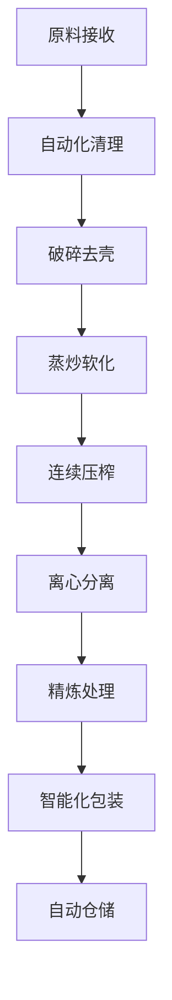

# 中型油厂解决方案

## 概述

中型油厂解决方案专为专业油厂、地区品牌和连锁企业设计，提供高效稳定的油料加工生产线，帮助您建立区域性的油料加工品牌。山东盛世赫程机械有限公司提供从生产线设计到品牌运营的全方位解决方案。

## 适用场景

### 🏭 专业油厂
- **目标用户**: 独立油料加工企业
- **日处理量**: 5-15吨
- **投资预算**: 100-300万元

### 🏢 地区品牌
- **目标用户**: 区域性油品品牌企业
- **日处理量**: 8-20吨
- **投资预算**: 200-500万元

### 🏪 连锁企业
- **目标用户**: 油品连锁门店、加盟商
- **日处理量**: 5-12吨
- **投资预算**: 150-400万元

## 主要设备配置

### 标准配置（100-200万元）
- **355系列榨油机** × 1-2台
- 自动化预处理生产线
- 多级过滤精炼系统
- 智能化控制系统

### 增强配置（200-400万元）
- **355/400系列榨油机** × 2-3台
- 全自动预处理生产线
- 连续精炼设备系统
- 仓储物流自动化系统

### 旗舰配置（400-600万元）
- **400系列智能榨油机** × 2-4台
- 全自动化生产线
- 智能化管理系统
- 品牌包装生产线

## 加工工艺流程

## 技术特点

### ⚡ 高效率生产
- 自动化生产线，生产效率高
- 24小时连续生产能力
- 智能化质量控制系统

### 🎯 品质保障
- 多级精炼工艺，出油率高
- 温度压力精准控制
- 产品质量稳定可靠

### 🔧 智能管理
- 生产数据实时监控
- 设备运行状态分析
- 能耗优化管理系统

## 适用油料作物

### 🌾 主要粮油作物
- **大豆**: 大批量加工，适合规模化生产
- **花生**: 高品质花生油，品牌化运营
- **芝麻**: 专业芝麻油生产线
- **油菜籽**: 菜籽油精炼工艺

### 🥜 坚果类作物
- **核桃**: 核桃油深加工生产线
- **杏仁**: 杏仁油美容护肤系列
- **榛子**: 榛子油高端品牌

### 🥑 果实类作物
- **葡萄籽**: 葡萄籽油保健品原料
- **南瓜籽**: 南瓜籽油营养食品

## 产品系列

### 🍳 食用油系列
- 普通食用油
- 高端营养油
- 有机食品油
- 特种调味油

### 💄 功能性油品
- 美容护肤油
- 保健营养油
- 婴儿食用油
- 特医食品油

### 🏭 工业用油
- 生物柴油原料
- 润滑油基础油
- 化工原料油

## 投资回报分析

### 💰 成本结构
- **设备投资**: 100-500万元
- **厂房建设**: 50-200万元
- **流动资金**: 50-150万元
- **总投资**: 200-850万元

### 📈 收益预期
- **年销售额**: 500-2000万元
- **毛利率**: 25-35%
- **年净利润**: 150-500万元
- **投资回收期**: 2-3年

## 服务保障

### 🛠️ 技术支持
- 生产线整体设计
- 设备安装调试服务
- 操作人员系统培训
- 生产工艺优化指导

### 🔧 售后服务
- 设备质量保证二年
- 24小时技术支持热线
- 定期维护保养服务
- 技术升级服务

### 📊 经营支持
- 市场调研分析报告
- 品牌建设咨询服务
- 销售渠道拓展指导
- 财务管理建议

## 成功案例

### 山东某专业花生油厂
- **设备配置**: 355系列榨油机×3台
- **日处理量**: 12吨花生
- **投资成本**: 280万元
- **年销售额**: 1200万元
- **市场覆盖**: 省内50个县市

### 河南某地区油品品牌
- **设备配置**: 400系列榨油机×2台
- **日处理量**: 15吨混合油料
- **投资成本**: 380万元
- **年销售额**: 1500万元
- **品牌价值**: 3000万元

### 浙江某油品连锁企业
- **设备配置**: 355系列榨油机×4台
- **日处理量**: 18吨油料
- **投资成本**: 450万元
- **门店数量**: 25家连锁店
- **年销售额**: 1800万元

## 质量管理体系

### 🏆 质量标准
- 符合国家食用油标准
- 通过HACCP体系认证
- 符合有机食品认证
- 通过ISO9001质量认证

### 🔍 检测能力
- 理化指标全项检测
- 营养成分分析
- 安全性检测
- 稳定性检测
- 感官品质评定

## 可持续发展

### 🌱 环保生产
- 废水循环利用系统
- 废渣综合利用
- 节能减排技术
- 绿色生产标准

### 🔄 资源利用
- 副产品深加工
- 产业链延伸
- 循环经济模式
- 资源综合利用

## 发展规划

### 📈 规模扩张
- 扩大生产能力
- 增加产品种类
- 拓展市场范围
- 提升品牌影响力

### 🎯 产业升级
- 智能化改造
- 数字化管理
- 品牌化运营
- 国际化发展

## 联系我们

如果您对中型油厂解决方案感兴趣，请联系我们的技术团队：

- 📞 **咨询热线**: +86 19906365856
- 📧 **邮箱**: sales@oil-pressing-machine.com
- 📍 **地址**: 山东省潍坊市青州市开发区益能街5888号

我们提供免费的项目可行性分析、设备配置方案设计和实地考察服务，为您打造最具竞争力的中型油厂解决方案。