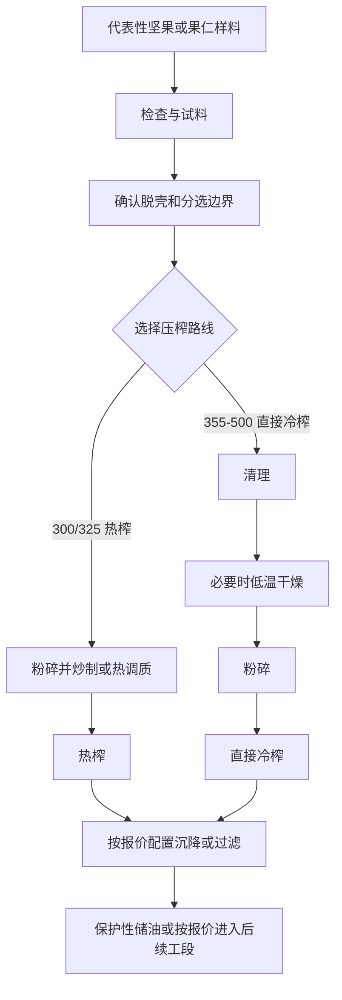

# 坚果类油料解决方案

## 采购范围

坚果油项目首先要区分带壳坚果、去壳果仁、破碎仁、干椰肉或其他已处理原料。果仁破损、氧化酸败、水分、壳屑、过敏原、储存历史以及油和饼粕用途，都会改变工艺、设备清单和整线价格。

本页不预填含油率、出油率、单批装料、产能、投资额、运行时长或成品等级。厂家报价应以代表性样料为依据，并明确脱壳、分选、干燥、粉碎、压榨、过滤、文件和服务哪些包含、哪些不包含。

## 原料差异

| 坚果或果仁组 | 需要确认的差异 | 前处理边界 |
| --- | --- | --- |
| 核桃、榛子与开心果仁 | 整仁或碎仁、壳屑、氧化或酸败指标、水分、等级和过敏原隔离 | 明确脱壳及人工或光学分选由采购方完成还是列入供货；粉碎和压榨由试料确定 |
| 杏仁及桃、杏等核仁 | 甜苦品种、去核去壳、食品/化妆品/工业用途和天然受控成分 | 不预设可食用或可用于化妆品；实验室要求和目的地合规应在选型前确认 |
| 腰果 | 果仁等级、焙炒历史、壳污染及腰果壳液分离情况 | 原壳处理属于独立安全工艺；除非书面包含，压榨报价只针对试料所示的合格果仁形态 |
| 椰肉或干椰肉 | 鲜椰肉与干椰肉的区别、水分、粒度、储存和霉变状态 | 鲜椰乳加工属于另一条工艺；压榨线只针对报价中明确的固体原料形态 |
| 棕榈果或棕榈仁 | 鲜棕榈果与棕榈仁是不同原料，提油路线不同 | 鲜棕榈果线不属于常规坚果液压压榨范围；已处理棕榈仁需单独试料和报价 |

不同坚果品种、等级和供应商应分别试料。不能由一种果仁推定混合坚果的产能、清洗换料、过敏原控制或油品结果。

## 机型路线与前处理边界

| 路线 | 机型 | 必须明确的工艺顺序 | 使用边界 |
| --- | --- | --- | --- |
| 热榨 | 300/325 系列 | 清理分选，按需要脱壳和仁壳分离，粉碎，炒制或热调质后压榨 | 侧重熟香或需要热处理的产品；热处理条件由样料试验确定 |
| 直接冷榨 | 355-500 系列 | 清理，样料确有需要时低温干燥，粉碎后直接冷榨 | 粉碎与压榨之间不预设炒制、蒸炒或蒸煮；机型和过滤按果仁试料确定 |

```mermaid
flowchart TD
    A[代表性坚果或果仁样料] --> B[检查与试料]
    B --> C[确认脱壳和分选边界]
    C --> D{选择压榨路线}
    D -->|300/325 热榨| E[粉碎并炒制或热调质]
    E --> F[热榨]
    D -->|355-500 直接冷榨| G[清理]
    G --> H[必要时低温干燥]
    H --> I[粉碎]
    I --> J[直接冷榨]
    F --> K[按报价配置沉降或过滤]
    J --> K
    K --> L[保护性储油或按报价进入后续工段]
```

脱壳、分选、低温干燥、炒制、精炼、灌装、冷藏、过敏原隔离、公用工程、实验室检测和废弃物处理是否包含，只以签字设备清单、责任清单和排除项为准。

## 样料条件与试验记录

寄样前应书面确认样料数量、包装、快递或货运、报关、试料费用、必要的清洗费用、耗材以及退回或处置方式。

样料资料至少说明：

- 常用名和植物学名称、品种、产地、供应商、批次、生产日期与储存条件
- 带壳坚果、去壳果仁、干椰肉或其他已处理形态
- 水分、壳占比、破损料、异物、霉变或酸败指标，以及如有的实验室含油率
- 已完成的干燥、焙炒、去皮、脱壳或化学处理
- 热榨或直接冷榨路线、风味、颜色、过滤、储存和油品用途
- 饼粕、粉料或其他副产品的用途和规格
- 过敏原、清洗要求、安全限制和目的市场要求

试料记录应包括实际前处理、净投入、粒度、水分、温度过程、压力程序、完整周期、收集油、饼、损耗、沉降或过滤口径、清洗换料观察和约定实验室方法。产能按经验证的完整周期和所有整线瓶颈计算。

## 厂家报价设备清单

坚果油生产线可根据项目选择：

- 原料接收、检验、分选和异物去除
- 可选脱壳、破壳、仁壳分离、分级或坏仁剔除设备
- 355-500 冷榨路线在样料需要时配置的低温干燥设备
- 按果仁和试料要求选择的粉碎设备
- 300/325 热榨路线所需炒制或热调质设备
- 选定压榨机、液压单元、接触件、防护和控制
- 集油、沉降、输送、过滤和保护性储油设备
- 饼粕收集、冷却、破碎或包装接口
- 项目要求的过敏原分区器具、容器或清洗配置
- 电控柜、图纸、说明书、约定备件和安装接口
- 另行报价的精炼、灌装、制冷、实验室、公用工程或包装设备

只有签字后的设备清单和排除项能够定义厂家实际供货范围。

## 报价输入与价格口径

为了获得本地化设备价格和可比的供应商报价，请提供：

- 计划加工的全部坚果或果仁及季节性原料安排
- 热榨或直接冷榨路线、目标产品和换料政策
- 目标产能、批次和班次方式、清洗时间及储存计划
- 项目国家与城市、厂房布局、进场、承载和吊装安排
- 电力、热源、水、压缩空气、通风、排水和冷藏条件
- 接触材质、过敏原、卫生、过滤、储油、精炼和灌装要求
- 采购方实验室方法、包装形式、文件语言和目的地合规清单
- 币种、贸易术语、交货点、出口包装、运保、税费、调试、培训和备件要求
- 如需同口径比较多种生产线配置，可提供预算区间

报价应把基础设备、选配、排除项、运费与贸易条款、公用工程假设、交付口径、检验验收、文件包、调试和售后分别列出。收益测算应采用采购方当前的果仁、产品、人工、能耗、物流、税费、融资和废弃物处理价格。

## FAT 与 SAT

### FAT 工厂验收

FAT 协议应明确坚果样料及前处理、设备配置、报价内安全功能、空载和带料检查、净投入、完整周期、油饼收集、温度记录、过滤口径、过敏原清洗观察、实验室留样、文件和验收标准。试料、样料处理、耗材、第三方检测及重复 FAT 的费用和责任应预先书面确认。

### SAT 现场验收

SAT 协议应确认现场就绪、公用工程、基础和进场、安装责任、现场原料与 FAT 样料的一致性、运行和清洗方法、受训人员、重复运行、实验室对比、记录和问题关闭。差旅、签证、当地人工、吊装、住宿、耗材和再次到场只有写入报价并计价后才属于服务范围。

## 合规与售后书面确认

合同应说明油和饼粕用于食品、饲料、化妆品、保健品还是工业用途，并列明目的地要求。过敏原管理、食品接触材质、卫生、职业安全、环保、标签、实验室检测，以及苦味核仁、原始腰果壳料、霉变和污染物控制，都需要明确责任方。

适用认证与标准必须按项目逐项核验，设备清单本身不附带国家、出口、有机、食品或化妆品合规结论。证书和检测报告应核对签约主体、工厂、机型、工艺、产品、有效状态和目的市场；成品的法律属性不由压榨机供应商单独决定。

售后条款应写明质保起算与范围、排除项、支持渠道和响应时段、远程与现场服务边界、人工和差旅费用、配件识别、价格及交期确认、耗材、说明书、培训和预防性维护责任。未写入合同的服务不视为包含。

## 联系我们

如需坚果油设备采购、生产线配置、厂家价格或正式报价，请联系技术与商务团队：

- **电话**: +86 19906365856
- **邮箱**: gavin@oil-pressing-machine.com
- **地址**: 山东省潍坊市青州市开发区益能街5888号

## 相关链接

- [解决方案总览](/zh/solutions/)
- [核桃（核桃油）解决方案](/zh/solutions/walnut)
- [杏仁（杏仁油）解决方案](/zh/solutions/almond)
- [腰果（腰果油）解决方案](/zh/solutions/cashew)
- [426系列液压榨油机](/zh/products/426)
- [联系我们获取方案](/zh/contact/)
- [English Page](/en/solutions/nuts)

## 获取价格/报价

提交原料和样料记录、工艺路线、目标生产安排、现场公用工程、整线边界、目的地要求和商务条款后，厂家报价可列出可比设备、选配、到货成本输入、验收和售后项目。

- [获取价格/报价](/zh/contact/)

<!-- quote-cta -->
