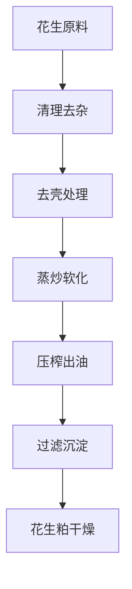
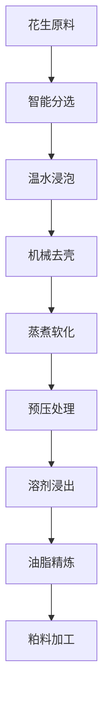

# 花生（花生油）解决方案

## 概述

花生是重要的油料和经济作物，花生油具有独特的香味和丰富的营养价值。山东盛世赫程机械有限公司提供专业花生压榨解决方案，满足从小型作坊到大型工厂的不同需求。

## 花生特性

### 📊 基本参数
- **含油率**: 45-55%
- **蛋白质含量**: 25-30%
- **主要脂肪酸**: 油酸（40-50%）、亚油酸（30-40%）
- **适宜温度**: 压榨温度控制在80-100℃

### 🌱 生长特性
- **生长周期**: 120-150天
- **适宜气候**: 温暖、阳光充足地区
- **土壤要求**: 疏松、肥沃的沙质土壤
- **年产量**: 中国年产量超过1600万吨

## 加工工艺

### 传统工艺流程

### 现代工艺流程

## 设备推荐

### 小型加工（日处理2-10吨）
- **300/325系列专用压榨机**
- 花生预处理设备
- 简易精炼系统
- 投资成本：50-150万元

### 中型加工（日处理10-50吨）
- **355/400系列压榨机**
- 自动化预处理生产线
- 连续精炼设备
- 投资成本：300-800万元

### 大型加工（日处理50吨以上）
- **425/480系列压榨机**
- 全自动生产线
- 智能化管理系统
- 投资成本：1500万元以上

## 技术优势

### 🎯 精准控制
- 温度控制：±2℃精度
- 压力控制：智能调节
- 炒制时间：最佳工艺参数

### 💧 油质保证
- 热榨工艺突出香味
- 物理压榨保证纯净
- 出油率高达48-50%

### 🔄 连续生产
- 自动化生产流程
- 连续压榨工艺
- 智能质量监控

## 产品应用

### 🍳 食用油
- 花生油：优质食用油
- 调和油：与其他油脂混合
- 特种油：高端营养油

### 🥛 副产品
- 花生粕：优质蛋白饲料
- 花生壳：燃料或饲料
- 花生蛋白：食品添加剂

### 💊 功能性产品
- 花生四烯酸
- 花生多酚
- 花生磷脂

## 市场分析

### 📈 发展趋势
- 健康食用油需求增长
- 高端花生油市场扩大
- 出口贸易机会增加

### 🎯 目标市场
- 食用油加工企业
- 食品加工企业
- 餐饮连锁企业
- 出口贸易企业

## 成功案例

### 山东某大型花生油加工厂
- **设备配置**: 400系列压榨机×6台
- **日处理量**: 80吨花生
- **出油率**: 48.5%
- **年产量**: 8000吨花生油
- **市场覆盖**: 全国15个省市

### 河南某专业花生油企业
- **设备配置**: 355系列专用机×4台
- **日处理量**: 30吨花生
- **产品质量**: 国家一级标准
- **品牌建设**: 区域知名品牌
- **年销售额**: 5000万元

### 广东某高端花生油品牌
- **设备配置**: 325系列专用机×8台
- **日处理量**: 20吨精品花生
- **产品质量**: 有机食品认证
- **市场定位**: 高端有机食用油
- **出口市场**: 东南亚、日本

## 质量标准

### 🏆 产品质量标准
- 符合国家花生油标准（GB 1535）
- 符合食品安全标准
- 符合出口食品标准
- 符合有机食品认证

### 🔍 检测项目
- 酸价检测
- 过氧化值检测
- 色泽透明度检测
- 重金属含量检测
- 黄曲霉毒素检测
- 农药残留检测

## 可持续发展

### 🌱 环保生产
- 废弃物循环利用
- 节能减排工艺
- 绿色生产标准

### 🔄 资源利用
- 副产品综合利用
- 产业链延伸
- 循环经济模式

### 🌍 社会责任
- 支持农民增收
- 保障食品安全
- 保护生态环境

## 联系我们

如果您对花生压榨解决方案感兴趣，请联系我们的技术团队：

- 📞 **咨询热线**: 400-888-8888
- 📧 **邮箱**: sales@oil-pressing-machine.com
- 📍 **地址**: 山东省潍坊市青州市开发区益能街5888号

我们提供免费的技术咨询、样品测试和实地考察服务，为您提供最适合的花生压榨解决方案。