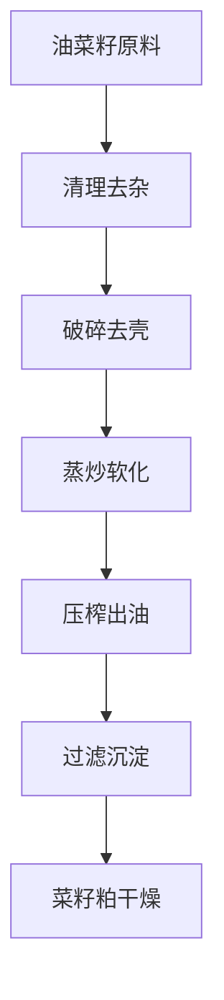
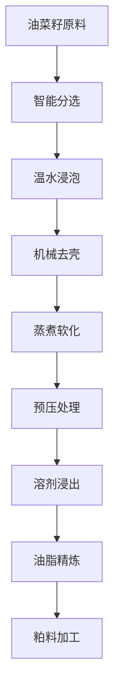

# 油菜籽（菜籽油）解决方案

## 概述

油菜籽是重要的油料作物，菜籽油是全球主要食用油之一。山东盛世赫程机械有限公司提供专业的油菜籽压榨解决方案，从小型作坊到大型工厂的全套设备和服务。

## 油菜籽特性

### 📊 基本参数
- **含油率**: 35-45%
- **蛋白质含量**: 20-25%
- **主要脂肪酸**: 油酸（55-70%）、亚油酸（15-25%）、亚麻酸（5-10%）
- **适宜温度**: 压榨温度控制在60-80℃

### 🌱 生长特性
- **生长周期**: 90-120天
- **适宜气候**: 凉爽、湿润地区
- **土壤要求**: 肥沃、中性土壤
- **年产量**: 全球年产量超过7000万吨

## 加工工艺

### 传统工艺流程

### 现代工艺流程

## 设备推荐

### 小型加工（日处理5-15吨）
- **355/400系列压榨机**
- 油菜籽预处理生产线
- 简易精炼设备
- 投资成本：150-350万元

### 中型加工（日处理15-50吨）
- **425/480系列压榨机**
- 完整预处理生产线
- 连续精炼设备
- 投资成本：600-1500万元

### 大型加工（日处理50吨以上）
- **500系列大型压榨机**
- 全自动生产线
- 智能化管理系统
- 投资成本：2000万元以上

## 技术优势

### 🎯 精准控制
- 温度控制：±2℃精度
- 压力控制：智能调节
- 湿度控制：最佳含水量

### 💧 油质保证
- 冷榨工艺保留营养
- 物理压榨无化学残留
- 出油率行业领先（38-42%）

### 🔄 连续生产
- 24小时不间断运行
- 自动化进料出料
- 智能故障报警

## 产品应用

### 🍳 食用油
- 菜籽油：主要食用油品种
- 调和油：与其他油脂混合
- 特种油：高端营养油

### 🥛 副产品
- 菜籽粕：优质蛋白饲料
- 菜籽蛋白：食品添加剂
- 菜籽磷脂：功能性成分

### 💊 功能性产品
- 菜籽异黄酮
- 菜籽多酚
- 菜籽甾醇

## 市场分析

### 📈 发展趋势
- 健康食用油需求增长
- 有机菜籽种植扩大
- 副产品综合利用提升

### 🎯 目标市场
- 食用油加工企业
- 饲料加工企业
- 食品加工企业
- 出口贸易企业

## 成功案例

### 山东某大型菜籽油加工厂
- **设备配置**: 480系列压榨机×8台
- **日处理量**: 120吨油菜籽
- **出油率**: 40.5%
- **年产量**: 1.5万吨菜籽油
- **市场覆盖**: 全国25个省市

### 湖北某现代化菜籽油企业
- **设备配置**: 500系列压榨机×6台
- **日处理量**: 80吨油菜籽
- **产品质量**: 符合国家一级标准
- **副产品利用**: 菜籽粕年产量10万吨
- **经济效益**: 年销售额3亿元

### 四川某有机菜籽油品牌
- **设备配置**: 400系列专用机×5台
- **日处理量**: 40吨有机油菜籽
- **产品质量**: 有机食品认证
- **品牌定位**: 高端有机食用油
- **市场定位**: 一二线城市高端市场

## 质量标准

### 🏆 产品质量标准
- 符合国家菜籽油标准（GB 1536）
- 符合食品安全标准
- 符合出口食品标准
- 符合有机食品认证

### 🔍 检测项目
- 酸价检测
- 过氧化值检测
- 色泽透明度检测
- 重金属含量检测
- 芥酸含量检测
- 农药残留检测

## 可持续发展

### 🌱 环保生产
- 废弃物循环利用
- 节能减排工艺
- 绿色生产标准

### 🔄 资源利用
- 副产品综合利用
- 产业链延伸
- 循环经济模式

### 🌍 社会责任
- 支持本地种植
- 提升农民收入
- 保障食品安全

## 联系我们

如果您对油菜籽压榨解决方案感兴趣，请联系我们的技术团队：

- 📞 **咨询热线**: +86 19906365856
- 📧 **邮箱**: sales@oil-pressing-machine.com
- 📍 **地址**: 山东省潍坊市青州市开发区益能街5888号

我们提供免费的技术咨询、样品测试和实地考察服务，为您提供最适合的油菜籽压榨解决方案。