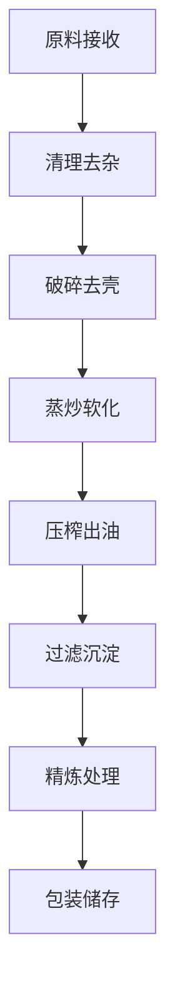

# 粮油类（种子类）解决方案

## 概述

粮油类种子是工业榨油和食用油的主要来源，具有产量大、成本低、加工工艺成熟等特点。山东盛世赫程机械有限公司提供从小型作坊到大型工厂的全套粮油种子加工解决方案。

## 主要粮油作物

### 🌱 大豆（豆油）
**含油率**: 18-22%
**特点**: 优质蛋白质来源，油质清澈
**适用设备**: 355/400系列榨油机
**加工工艺**: 浸泡→蒸炒→压榨→过滤

### 🥜 花生（花生油）
**含油率**: 45-55%
**特点**: 香味浓郁，营养丰富
**适用设备**: 300/325系列榨油机
**加工工艺**: 去壳→蒸炒→压榨→沉淀

### 🌰 芝麻（芝麻油）
**含油率**: 50-60%
**特点**: 香气独特，抗氧化强
**适用设备**: 300/325系列专用机
**加工工艺**: 去杂→炒香→压榨→过滤

### 🌿 油菜籽 / 菜籽（菜籽油）
**含油率**: 35-45%
**特点**: 产量高，价格实惠
**适用设备**: 355/400系列榨油机
**加工工艺**: 去壳→蒸炒→压榨→精炼

### 🌻 向日葵籽（葵花籽油）
**含油率**: 40-50%
**特点**: 色泽金黄，口感清爽
**适用设备**: 355/400系列榨油机
**加工工艺**: 去壳→蒸炒→压榨→过滤

### 🧵 棉籽（棉籽油）
**含油率**: 35-45%
**特点**: 工业用油，需脱毒处理
**适用设备**: 425/480系列工业机
**加工工艺**: 去壳→蒸炒→压榨→脱毒→精炼

### 🍇 葡萄籽（葡萄籽油）
**含油率**: 12-18%
**特点**: 营养丰富，抗氧化强
**适用设备**: 300/325系列专用机
**加工工艺**: 去壳→低温压榨→过滤→精炼

### 🌾 荞麦籽（荞麦油）
**含油率**: 25-35%
**特点**: 谷物油，营养均衡
**适用设备**: 300/325系列专用机
**加工工艺**: 去杂→蒸炒→压榨→过滤

### 🌾 亚麻籽 / 胡麻（亚麻籽油）
**含油率**: 35-45%
**特点**: Ω-3脂肪酸含量高
**适用设备**: 300/325系列专用机
**加工工艺**: 低温压榨→过滤→冷藏保存

### 🍵 茶籽 / 山茶籽（茶籽油）
**含油率**: 25-35%
**特点**: 茶多酚含量高，抗氧化
**适用设备**: 300/325系列榨油机
**加工工艺**: 去壳→低温压榨→过滤

### 🌱 苏子（苏子油/紫苏油）
**含油率**: 40-50%
**特点**: 特殊香气，药用价值
**适用设备**: 300/325系列专用机
**加工工艺**: 低温压榨→过滤→冷藏

## 设备推荐

### 小型加工（日处理1-5吨）
- **300/325系列榨油机**
- 基础预处理设备
- 简易过滤系统
- 投资成本：20-50万元

### 中型加工（日处理5-20吨）
- **355/400系列榨油机**
- 完整预处理生产线
- 精细过滤系统
- 投资成本：100-300万元

### 大型加工（日处理20吨以上）
- **425/480系列榨油机**
- 全自动预处理生产线
- 精炼设备系统
- 投资成本：500万元以上

## 加工工艺流程

## 技术优势

### 🎯 精准控制
- 温度控制：±2℃精度
- 压力控制：精确调节
- 湿度控制：最佳含水量

### 🔄 连续生产
- 24小时不间断运行
- 自动化进料出料
- 智能故障报警

### 💧 油质保证
- 冷榨工艺保留营养
- 物理压榨无化学残留
- 出油率行业领先

## 市场前景

### 📈 发展趋势
- 健康食用油需求增长
- 有机食品市场扩大
- 出口贸易机会增加

### 🎯 目标市场
- 国内食品加工企业
- 出口贸易公司
- 健康食品品牌
- 餐饮连锁企业

## 服务保障

### 🛠️ 技术支持
- 设备安装调试
- 操作人员培训
- 工艺技术指导
- 配方优化建议

### 🔧 售后服务
- 24小时技术支持
- 配件及时供应
- 定期维护保养
- 终身技术服务

### 📊 数据监控
- 生产数据实时监控
- 设备运行状态分析
- 能耗优化建议
- 产量质量统计

## 案例分享

### 山东某大型油厂
- **设备配置**: 425系列榨油机×5台
- **日处理量**: 50吨大豆
- **出油率**: 18.5%
- **年产量**: 3000吨豆油
- **投资回报**: 2年回本

### 河南某专业花生油厂
- **设备配置**: 355系列榨油机×3台
- **日处理量**: 15吨花生
- **出油率**: 48%
- **产品质量**: 国家一级标准
- **市场覆盖**: 省内20个城市

## 联系我们

如果您对粮油类种子加工解决方案感兴趣，请联系我们的技术团队：

- 📞 **咨询热线**: +86 19906365856
- 📧 **邮箱**: sales@oil-pressing-machine.com
- 📍 **地址**: 山东省潍坊市青州市开发区益能街5888号

我们将根据您的具体需求，提供个性化的解决方案和技术支持。