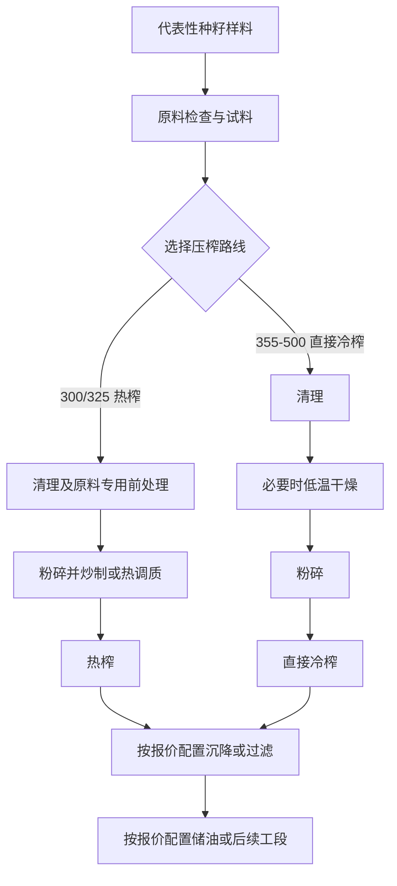

# 粮油类（种子类）解决方案

## 采购范围

种子类油料的工艺取决于具体作物、品种、收储条件、杂质、水分、壳仁比例、实验室含油率、目标油品和饼粕用途。同一机型不能脱离样料条件直接承诺出油、单批装料、日产能或成品等级；可比的厂家报价应以代表性样料、明确工艺、现场条件和书面供货边界为基础。

本页不预填含油率、出油率、产能、投资额、运行时长或油品等级。需要作为验收依据的数值，必须来自约定试料方法并写入报价或合同。

## 原料差异

| 原料组 | 需要确认的差异 | 前处理判断 |
| --- | --- | --- |
| 大豆与花生 | 品种、水分、皮壳、破损、储存状态、饼粕用途；花生还需确认黄曲霉毒素等食品安全风险 | 根据样料和产品目标确定分级、脱壳、脱皮、粉碎、热处理或冷榨准备 |
| 芝麻、油菜籽、紫苏籽与亚麻籽 | 小颗粒清选、细粉、流动性、氧化敏感性、风味目标和换料风险 | 按杂质选择筛理与清选；只有热榨路线采用炒制或热调质 |
| 葵花籽、棉籽与茶籽 | 壳仁比例、仁破损、异物以及壳对压榨和过滤的影响 | 通过试料确认是否脱壳或仁壳分离；棉籽另需书面确认棉酚、精炼和用途合规边界 |
| 葡萄籽及其他副产种籽 | 残留果肉或糖分、发酵历史、干燥状态、细粉和储存时间 | 确认清理、必要时低温干燥、粉碎、过滤负荷及是否适合压榨 |

不同作物、品种、供应商和收获批次应分别试料，不能用一种种籽的结果推定另一种。

## 机型路线与前处理边界

| 路线 | 机型 | 必须明确的工艺顺序 | 使用边界 |
| --- | --- | --- | --- |
| 热榨 | 300/325 系列 | 清理分选，按原料需要脱壳或脱皮，粉碎，炒制或热调质后压榨 | 侧重需要熟香或热处理的产品；温度和保温条件以样料试验为准 |
| 直接冷榨 | 355-500 系列 | 清理，样料确有需要时低温干燥，粉碎后直接冷榨 | 粉碎与压榨之间不预设炒制、蒸炒或蒸煮；具体机型由试料和整线平衡确认 |

```mermaid
flowchart TD
    A[代表性种籽样料] --> B[原料检查与试料]
    B --> C{选择压榨路线}
    C -->|300/325 热榨| D[清理及原料专用前处理]
    D --> E[粉碎并炒制或热调质]
    E --> F[热榨]
    C -->|355-500 直接冷榨| G[清理]
    G --> H[必要时低温干燥]
    H --> I[粉碎]
    I --> J[直接冷榨]
    F --> K[按报价配置沉降或过滤]
    J --> K
    K --> L[按报价配置储油或后续工段]
```

收料、清选、脱壳、炒制、低温干燥、精炼、灌装、公用工程、土建、实验室检测和废弃物处理是否由厂家供货，只以双方签字的设备清单、排除项和接口表为准。

## 样料条件与试验记录

寄送样料前，应书面确认样料数量、包装、物流、报关、试料费用、耗材、样料退回或处置方式。

样料资料至少说明：

- 作物与品种、产地、供应商、批次及收储历史
- 整籽、仁料或副产物形态，以及杂质、壳、破损料和水分状态
- 如有实验室含油率，注明检测方法，但不把该数值等同于设备出油率
- 已完成的清选、脱壳、干燥、炒制或其他处理
- 拟采用热榨或直接冷榨、油品用途、饼粕用途、过滤口径和实验室指标
- 运输与试验相关的图片、安全资料、过敏原和已知污染物信息

试料记录应写明实际前处理、净投入、水分、粒度、温度过程、压力程序、完整周期、收集油、饼、损耗、过滤口径、清洗时间和实验室方法。报价产能应按完整循环和整线瓶颈计算，不能只按机型名称推定。

## 厂家报价设备清单

种籽油生产线可按项目选择下列设备，但只有签字清单中的项目属于供货范围：

- 原料接收、取样和检验接口
- 按实际杂质选择的清选和分级设备
- 指定种籽需要的脱壳、脱皮、仁壳分离或分级设备
- 按试料粒度确定的粉碎或压片设备
- 300/325 热榨路线所需炒籽或热调质设备
- 355-500 冷榨路线在样料需要时配置的低温干燥设备
- 选定压榨机、液压单元、接触件、防护和控制
- 集油、沉降、输送、过滤和储油设备
- 饼粕出料、收集、冷却或包装接口
- 电控柜、约定边界内电缆、说明书、图纸和约定备件
- 另行报价的精炼、灌装、实验室、公用工程或物料输送系统

## 报价输入与价格口径

为了获得可采购、可横向比较的厂家价格，请提供：

- 准确原料名称，以及同线计划加工的全部原料
- 热榨或直接冷榨路线、目标油品和饼粕产品
- 目标产能、批次方式、班次计划、季节性安排和换料频率
- 项目国家与城市、厂房尺寸、进场通道、吊装和地面承载条件
- 现场电压、频率、相制、热源、水、压缩空气、通风和排水条件
- 接触材质、过滤口径、储油、精炼、灌装和包装边界
- 文件语言、目的地法规清单、检验文件和采购方验收方法
- 报价币种、贸易术语、交货地点、包装、运保、税费、调试、培训和备件范围
- 如需比较不同配置，可提供预算区间，但预算不能替代样料和性能验证

正式报价应分项写明机型与数量、辅机、选配、排除项、公用工程假设、商务条款、报价有效期、交付口径、文件包和售后范围。投资测算中的原料、人工、能耗、融资、税费、物流和产品销售价格，应采用采购方所在地的当前数据。

## FAT 与 SAT

### FAT 工厂验收

只有在样料、方法、费用和验收标准书面约定后才进行 FAT。协议应覆盖设备身份与配置、报价内安全功能、空载与带料运行、约定前处理、物料平衡、完整周期、温度记录、过滤口径、油饼取样、清洗、文件和偏差处理。未写入 FAT 协议的数值不作为保证值。

### SAT 现场验收

SAT 应约定现场就绪条件、公用工程、基础、吊装与人工责任、安装调试边界、现场原料与 FAT 样料的一致性、操作人员参与、重复运行方法、实验室检测、培训记录和问题关闭。差旅、签证、住宿、当地交通、耗材、第三方检测和再次到场是否包含及如何计价，必须写入报价或合同。

## 合规与售后书面确认

采购方应说明目的国家以及油和饼粕用于食品、饲料、化妆品、保健品还是工业用途。产品、工厂、机械安全、电气、食品接触、标签、过敏原、环保和职业安全要求，应在合同中逐项列明责任方。

适用认证与标准必须按项目逐项核验，设备清单本身不附带国家、出口、有机、食品或化妆品合规结论。所有证书和报告都应核对签约主体、工厂、机型、工艺、产品、有效状态和目的市场；仅有压榨设备不能证明成品油合规。

售后条款应书面约定质保起算与范围、排除项、支持渠道和响应时段、远程与现场服务边界、人工和差旅费用、配件规格与交期确认、耗材、培训、文件语言和维护责任。未写入合同的服务不视为包含。

## 联系我们

如需种籽油设备选型、生产线价格、厂家比较或正式项目报价，请联系技术与商务团队：

- **电话**: +86 19906365856
- **邮箱**: gavin@oil-pressing-machine.com
- **地址**: 山东省潍坊市青州市开发区益能街5888号

## 相关链接

- [解决方案总览](/zh/solutions/)
- [大豆（豆油）解决方案](/zh/solutions/soybean)
- [花生（花生油）解决方案](/zh/solutions/peanut)
- [油菜籽油解决方案](/zh/solutions/rapeseed)
- [产品系列总览](/zh/products/)
- [联系我们获取方案](/zh/contact/)
- [English Page](/en/solutions/seed-oils)

## 获取价格/报价

提交原料资料、工艺路线、目标产能、现场公用工程、目的地、设备边界和商务条款后，厂家报价可分别列出基础生产线、选配、运费、调试、文件和售后项目，便于采购审核。

- [获取价格/报价](/zh/contact/)

<!-- quote-cta -->
