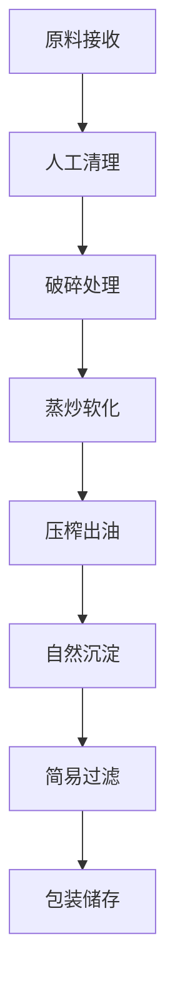

# 小型榨油坊解决方案

## 概述

小型榨油坊解决方案专为创业者、农村合作社和家庭作坊设计，提供经济高效的油料加工设备和工艺，帮助您快速启动油料加工业务。山东盛世赫程机械有限公司提供从设备选型到技术培训的全程服务支持。

## 适用场景

### 🏠 家庭作坊
- **目标用户**: 农村创业者、家庭农场主
- **日处理量**: 0.5-1吨
- **投资预算**: 15-30万元

### 🏘️ 农村合作社
- **目标用户**: 村集体、农民专业合作社
- **日处理量**: 1-3吨
- **投资预算**: 30-50万元

### 🏪 小型门店
- **目标用户**: 创业个体、特色油品店
- **日处理量**: 0.5-2吨
- **投资预算**: 20-40万元

## 主要设备配置

### 基础配置（15-30万元）
- **300系列榨油机** × 1台
- 基础清理设备
- 简易过滤系统
- 基础电气控制柜

### 标准配置（30-50万元）
- **300/325系列榨油机** × 1台
- 自动进料系统
- 多级过滤设备
- 温度控制系统
- 基础自动化控制

## 加工工艺流程

## 技术特点

### 💰 经济实用
- 设备投资小，回本快
- 操作简单，易于维护
- 能耗低，运行成本低

### 🎯 灵活多用
- 可加工多种油料作物
- 生产规模可灵活调整
- 产品多样化选择

### 🔧 易于操作
- 手动操作为主，自动化辅助
- 技术要求不高，易学易用
- 维护保养简单

## 适用油料作物

### 🌾 主要粮油作物
- **大豆**: 18-22%含油率，适合小型加工
- **花生**: 45-55%含油率，高品质食用油
- **芝麻**: 50-60%含油率，香气浓郁

### 🥜 坚果类作物
- **核桃**: 60-70%含油率，高端营养油
- **杏仁**: 45-55%含油率，美容护肤
- **榛子**: 55-65%含油率，维生素E丰富

### 🥑 果实类作物
- **葡萄籽**: 12-18%含油率，抗氧化强
- **南瓜籽**: 35-45%含油率，营养均衡

## 产品应用

### 🍳 食用油
- 家庭自用油
- 特色农家油
- 小批量定制油

### 🏪 零售销售
- 农贸市场销售
- 社区门店经营
- 线上平台销售

### 🎁 礼品定制
- 特色礼品油
- 节日定制油
- 企业福利油

## 投资回报分析

### 💰 成本结构
- **设备投资**: 20-50万元
- **厂房建设**: 10-20万元
- **流动资金**: 5-10万元
- **总投资**: 35-80万元

### 📈 收益预期
- **月销售额**: 5-15万元
- **毛利率**: 30-50%
- **月净利润**: 2-6万元
- **投资回收期**: 8-18个月

## 服务保障

### 🛠️ 技术支持
- 设备安装调试指导
- 操作人员现场培训
- 生产工艺技术指导
- 配方优化建议

### 🔧 售后服务
- 设备质量保证一年
- 24小时技术咨询服务
- 配件及时供应
- 定期回访维护

### 📊 经营指导
- 市场分析报告
- 销售渠道建议
- 品牌建设指导
- 经营策略咨询

## 成功案例

### 山东某村级油坊
- **设备配置**: 300系列榨油机×1台
- **日处理量**: 1.5吨花生
- **投资成本**: 25万元
- **月销售额**: 8万元
- **投资回收**: 10个月

### 河南某家庭农场
- **设备配置**: 325系列榨油机×1台
- **日处理量**: 2吨混合油料
- **投资成本**: 35万元
- **月销售额**: 12万元
- **特色产品**: 有机芝麻油

### 浙江某特色油品店
- **设备配置**: 300系列榨油机×1台
- **日处理量**: 1吨核桃仁
- **投资成本**: 28万元
- **月销售额**: 15万元
- **市场定位**: 高端礼品油

## 质量标准

### 🏆 产品质量标准
- 符合国家食用油卫生标准
- 符合地方特色农产品标准
- 符合有机食品认证要求

### 🔍 检测项目
- 酸价检测
- 过氧化值检测
- 杂质含量检测
- 感官品质评定

## 发展建议

### 📈 升级路径
- 扩大生产规模
- 提升自动化水平
- 拓展产品种类
- 建立品牌形象

### 🎯 市场拓展
- 开发线上销售渠道
- 参与农产品展会
- 建立经销商网络
- 开展品牌营销

## 联系我们

如果您对小型榨油坊解决方案感兴趣，请联系我们的技术团队：

- 📞 **咨询热线**: +86 19906365856
- 📧 **邮箱**: sales@oil-pressing-machine.com
- 📍 **地址**: 山东省潍坊市青州市开发区益能街5888号

我们提供免费的项目评估、设备选型咨询和实地考察服务，为您量身定制最适合的小型榨油坊解决方案。