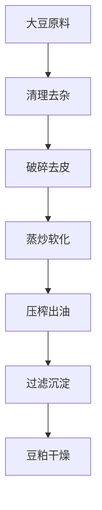
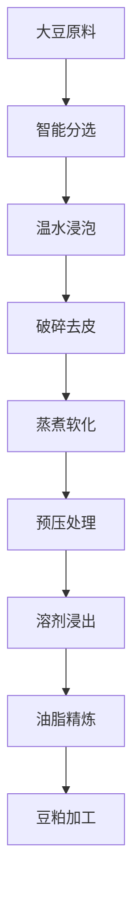

# 大豆（豆油）解决方案

## 概述

大豆是世界上最重要的油料作物之一，豆油是主要的食用油品种。山东盛世赫程机械有限公司提供专业的大豆压榨解决方案，从小型作坊到大型工厂的全套设备和服务。

## 大豆特性

### 📊 基本参数
- **含油率**: 18-22%
- **蛋白质含量**: 35-40%
- **主要脂肪酸**: 亚油酸（50-60%）、油酸（20-30%）、亚麻酸（5-10%）
- **适宜温度**: 压榨温度控制在60-80℃

### 🌱 生长特性
- **生长周期**: 90-150天
- **适宜气候**: 温带和亚热带地区
- **土壤要求**: 肥沃、排水良好的土壤
- **年产量**: 全球年产量超过3亿吨

## 加工工艺

### 传统工艺流程

### 现代工艺流程

## 设备推荐

### 小型加工（日处理5-20吨）
- **355/400系列压榨机**
- 大豆预处理生产线
- 简易精炼设备
- 投资成本：200-500万元

### 中型加工（日处理20-100吨）
- **425/480系列压榨机**
- 完整预处理生产线
- 连续精炼设备
- 投资成本：800-2000万元

### 大型加工（日处理100吨以上）
- **500系列大型压榨机**
- 全自动生产线
- 智能化管理系统
- 投资成本：3000万元以上

## 技术优势

### 🎯 精准控制
- 温度控制：±2℃精度
- 压力控制：智能调节
- 湿度控制：最佳含水量
- 时间控制：最佳工艺参数

### 💧 油质保证
- 冷榨工艺保留营养
- 物理压榨无化学残留
- 出油率行业领先（18-20%）

### 🔄 连续生产
- 24小时不间断运行
- 自动化进料出料
- 智能故障报警

## 产品应用

### 🍳 食用油
- 豆油：主要食用油品种
- 调和油：与其他油脂混合
- 特种油：高端营养油

### 🥛 副产品
- 豆粕：优质蛋白饲料
- 豆浆：食品加工原料
- 豆皮：副产品综合利用

### 💊 功能性产品
- 大豆卵磷脂
- 大豆异黄酮
- 大豆蛋白制品

## 市场分析

### 📈 发展趋势
- 健康食用油需求增长
- 有机大豆种植扩大
- 副产品综合利用提升

### 🎯 目标市场
- 食用油加工企业
- 饲料加工企业
- 食品加工企业
- 出口贸易企业

## 成功案例

### 山东某大型豆油加工厂
- **设备配置**: 480系列压榨机×8台
- **日处理量**: 200吨大豆
- **出油率**: 19.2%
- **年产量**: 1.2万吨豆油
- **市场覆盖**: 全国20个省市

### 河南某现代化豆油企业
- **设备配置**: 500系列压榨机×6台
- **日处理量**: 150吨大豆
- **产品质量**: 符合国家一级标准
- **副产品利用**: 豆粕年产量8万吨
- **经济效益**: 年销售额2亿元

### 东北某有机豆油品牌
- **设备配置**: 400系列专用机×4台
- **日处理量**: 50吨有机大豆
- **产品质量**: 有机食品认证
- **品牌定位**: 高端有机食用油
- **市场定位**: 一二线城市高端市场

## 质量标准

### 🏆 产品质量标准
- 符合国家豆油标准（GB 1534）
- 符合食品安全标准
- 符合出口食品标准
- 符合有机食品认证

### 🔍 检测项目
- 酸价检测
- 过氧化值检测
- 色泽透明度检测
- 重金属含量检测
- 农药残留检测
- 黄曲霉毒素检测

## 可持续发展

### 🌱 环保生产
- 废弃物循环利用
- 节能减排工艺
- 绿色生产标准

### 🔄 资源利用
- 副产品综合利用
- 产业链延伸
- 循环经济模式

### 🌍 社会责任
- 支持本地种植
- 提升农民收入
- 保障食品安全

## 联系我们

如果您对大豆压榨解决方案感兴趣，请联系我们的技术团队：

- 📞 **咨询热线**: 400-888-8888
- 📧 **邮箱**: sales@oil-pressing-machine.com
- 📍 **地址**: 山东省潍坊市青州市开发区益能街5888号

我们提供免费的技术咨询、样品测试和实地考察服务，为您提供最适合的大豆压榨解决方案。