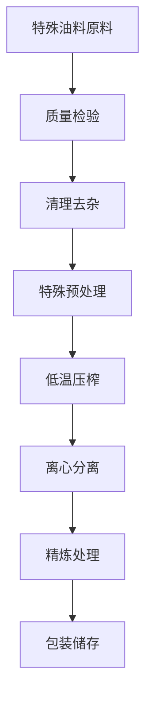

# 特殊油料加工解决方案

## 概述

特殊油料包括芝麻、亚麻籽、苏子等高价值油料作物，具有独特的营养成分和健康价值。山东盛世赫程机械有限公司提供专业的特殊油料加工解决方案，满足高端食用油和功能性食品的市场需求。

## 主要特殊油料

### 🌰 芝麻（芝麻油）
**含油率**: 50-60%
**特点**: 香气独特，抗氧化能力强
**适用设备**: 300/325系列专用机
**加工工艺**: 去杂→炒香→低温压榨→过滤

### 🌾 亚麻籽 / 胡麻（亚麻籽油）
**含油率**: 35-45%
**特点**: Ω-3脂肪酸含量高，营养均衡
**适用设备**: 300/325系列专用机
**加工工艺**: 低温压榨→过滤→冷藏保存

### 🌱 苏子（苏子油/紫苏油）
**含油率**: 40-50%
**特点**: 特殊香气，药用价值高
**适用设备**: 300/325系列专用机
**加工工艺**: 低温压榨→过滤→冷藏

### 🍵 茶籽 / 山茶籽（茶籽油）
**含油率**: 25-35%
**特点**: 茶多酚含量高，抗氧化
**适用设备**: 300/325系列榨油机
**加工工艺**: 去壳→低温压榨→过滤

### 🌿 蓖麻籽（蓖麻油）
**含油率**: 45-55%
**特点**: 工业润滑油，生物柴油原料
**适用设备**: 425/480系列工业机
**加工工艺**: 去壳→蒸煮→压榨→精炼

## 设备推荐

### 小型加工（日处理0.5-2吨）
- **300/325系列专用榨油机**
- 特殊油料预处理设备
- 低温控制系统
- 投资成本：40-100万元

### 中型加工（日处理2-10吨）
- **355/400系列榨油机**
- 自动化预处理生产线
- 温度控制系统
- 投资成本：200-500万元

### 大型加工（日处理10吨以上）
- **425/480系列榨油机**
- 全自动生产线
- 智能化管理系统
- 投资成本：800万元以上

## 加工工艺流程

## 技术特点

### ❄️ 低温工艺
- 保留营养成分
- 保持天然香气
- 提高油质稳定性

### 🎯 精准控制
- 温度控制：±1℃精度
- 压力控制：智能调节
- 时间控制：最佳工艺参数

### 🔄 连续生产
- 自动化进料系统
- 连续压榨工艺
- 智能监控系统

## 产品应用

### 🍳 高端食用油
- 芝麻油：调味和烹饪
- 亚麻籽油：营养保健
- 茶籽油：健康食用

### 💄 美容护肤
- 天然护肤油
- 按摩精油
- 护发素原料

### 💊 保健品
- 营养补充剂
- 功能性食品
- 药用制剂

### 🏭 工业应用
- 润滑油基础油
- 生物柴油原料
- 化工原料

## 营养价值

### 🌰 芝麻油
- 维生素E含量丰富
- 抗氧化能力强
- 心血管健康保护

### 🌾 亚麻籽油
- Ω-3脂肪酸含量高
- 改善心血管健康
- 抗炎作用

### 🍵 茶籽油
- 茶多酚含量高
- 抗氧化能力强
- 美容护肤效果好

## 市场前景

### 📈 发展趋势
- 功能性食品需求增长
- 健康美容市场扩大
- 高端油品市场发展

### 🎯 目标市场
- 高端食品品牌
- 美容护肤企业
- 保健品制造商
- 专业营养品公司

## 服务保障

### 🛠️ 技术支持
- 工艺参数优化
- 设备调试运行
- 操作人员培训
- 质量控制指导

### 🔧 售后服务
- 7×24小时技术支持
- 配件快速供应
- 定期维护保养
- 技术升级服务

### 📊 数据服务
- 生产数据分析
- 质量检测报告
- 市场趋势分析
- 客户需求调研

## 成功案例

### 山东某高端芝麻油加工厂
- **设备配置**: 325系列专用机×3台
- **日处理量**: 5吨芝麻
- **产品定位**: 高端有机芝麻油
- **市场优势**: 纯正芝麻香味
- **年销售额**: 1500万元

### 河南某亚麻籽油生产企业
- **设备配置**: 300系列专用机×4台
- **日处理量**: 3吨亚麻籽
- **产品质量**: 有机食品认证
- **市场定位**: 营养保健油品
- **出口市场**: 欧洲、北美

### 浙江某茶籽油品牌企业
- **设备配置**: 355系列榨油机×2台
- **日处理量**: 8吨茶籽
- **产品质量**: 符合化妆品标准
- **产品应用**: 美容护肤产品
- **年销售额**: 2000万元

## 质量标准

### 🏆 产品质量标准
- 符合国家相关标准
- 符合有机食品认证
- 符合出口食品标准
- 符合美容护肤标准

### 🔍 检测项目
- 酸价检测
- 过氧化值检测
- 色泽透明度检测
- 重金属含量检测
- 农药残留检测
- 营养成分分析

## 技术创新

### 🔬 工艺创新
- 新型提取技术
- 低温保护工艺
- 高效分离技术

### 📊 数据驱动
- 智能质量控制
- 大数据分析应用
- 工艺参数优化

### 🌱 可持续发展
- 资源综合利用
- 节能减排工艺
- 绿色生产标准

## 联系我们

如果您对特殊油料加工解决方案感兴趣，请联系我们的专家团队：

- 📞 **咨询热线**: +86 19906365856
- 📧 **邮箱**: sales@oil-pressing-machine.com
- 📍 **地址**: 山东省潍坊市青州市开发区益能街5888号

我们提供免费的技术咨询、样品测试和工艺验证服务，为您提供最专业的特殊油料加工解决方案。