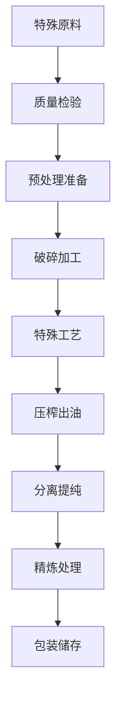

# 其他特殊油料解决方案

## 概述

特殊油料包括米糠、玉米胚芽、蓖麻籽等非常规油料作物，具有独特的营养价值和工业应用价值。山东盛世赫程机械有限公司提供专业的特殊油料加工解决方案，满足多元化市场需求。

## 主要特殊油料

### 🍚 米糠（米糠油）
**含油率**: 15-25%
**特点**: 天然抗氧化剂γ-谷维素含量高
**适用设备**: 300/325系列专用机
**加工工艺**: 米糠提取→低温压榨→过滤→精炼

### 🌽 玉米胚芽（玉米油）
**含油率**: 35-45%
**特点**: 维生素E含量丰富，稳定性好
**适用设备**: 355/400系列榨油机
**加工工艺**: 胚芽分离→干燥→压榨→过滤

### 🌿 蓖麻籽（蓖麻油）
**含油率**: 45-55%
**特点**: 工业润滑油，生物柴油原料
**适用设备**: 425/480系列工业机
**加工工艺**: 去壳→蒸煮→压榨→精炼

### 🌶️ 辣椒籽（辣椒籽油）
**含油率**: 15-25%
**特点**: 辣椒素含量高，药用保健价值
**适用设备**: 300/325系列专用机
**加工工艺**: 去壳→低温压榨→过滤

### 🍇 葡萄籽 / 荞麦籽（高价值油）
**含油率**: 10-20%
**特点**: 多酚含量高，抗氧化能力强
**适用设备**: 300/325系列专用机
**加工工艺**: 籽壳分离→低温压榨→过滤→精炼

## 设备推荐

### 小型加工（日处理0.5-3吨）
- **300/325系列专用榨油机**
- 特殊预处理设备
- 低温控制系统
- 投资成本：50-120万元

### 中型加工（日处理3-15吨）
- **355/400系列榨油机**
- 自动化预处理生产线
- 多级过滤系统
- 投资成本：250-600万元

### 大型加工（日处理15吨以上）
- **425/480系列榨油机**
- 全自动生产线
- 智能化管理系统
- 投资成本：1000万元以上

## 加工工艺流程

## 技术特点

### 🎯 特殊工艺
- 针对性预处理
- 专用压榨工艺
- 特殊精炼方法

### ❄️ 低温保护
- 保留活性成分
- 保持天然特性
- 提高产品价值

### 🔄 精准控制
- 参数精确控制
- 质量实时监测
- 自动化调节

## 产品应用

### 💊 保健品原料
- 天然抗氧化剂
- 功能性营养素
- 药用制剂原料

### 🏭 工业应用
- 润滑油基础油
- 生物柴油原料
- 化工原料

### 🍳 特色食用油
- 高端营养油
- 功能性食用油
- 特色调味油

## 营养保健价值

### 🍚 米糠油
- γ-谷维素含量高
- 抗氧化能力强
- 心血管保护

### 🌽 玉米油
- 维生素E丰富
- 不饱和脂肪酸均衡
- 皮肤健康保护

### 🌶️ 辣椒籽油
- 辣椒素含量高
- 促进新陈代谢
- 增强免疫力

## 市场前景

### 📈 发展趋势
- 功能性食品需求增长
- 天然抗氧化剂市场扩大
- 生物基材料应用增加

### 🎯 目标市场
- 保健品企业
- 食品加工企业
- 化工原料企业
- 美容护肤品牌

## 服务保障

### 🛠️ 技术支持
- 特殊工艺研发
- 设备定制设计
- 操作技术培训
- 质量控制指导

### 🔧 售后服务
- 7×24小时技术支持
- 专用配件供应
- 定期技术维护
- 工艺优化升级

### 📊 数据服务
- 生产数据分析
- 质量检测报告
- 市场趋势分析
- 客户需求调研

## 成功案例

### 山东某米糠油加工企业
- **设备配置**: 355系列专用机×2台
- **日处理量**: 10吨米糠
- **产品定位**: 高端营养油
- **市场优势**: γ-谷维素含量行业领先
- **年销售额**: 800万元

### 河南某玉米油加工厂
- **设备配置**: 400系列榨油机×1台
- **日处理量**: 8吨玉米胚芽
- **产品质量**: 符合国家一级标准
- **品牌建设**: 区域知名品牌
- **市场覆盖**: 全国10个省市

### 河北某蓖麻油加工企业
- **设备配置**: 425系列工业机×1台
- **日处理量**: 12吨蓖麻籽
- **产品应用**: 工业润滑油
- **质量标准**: 符合工业标准
- **年产量**: 5000吨

## 质量标准

### 🏆 产品质量标准
- 符合国家相关标准
- 符合行业质量要求
- 符合出口质量标准
- 符合安全卫生标准

### 🔍 检测项目
- 理化指标检测
- 营养成分分析
- 安全性检测
- 稳定性检测
- 特殊成分检测

## 技术创新

### 🔬 工艺创新
- 新型提取技术
- 低温保护工艺
- 高效分离技术

### 📊 数据驱动
- 智能质量控制
- 大数据分析应用
- 工艺参数优化

### 🌱 可持续发展
- 资源综合利用
- 节能减排工艺
- 绿色生产标准

## 联系我们

如果您对特殊油料加工解决方案感兴趣，请联系我们的专家团队：

- 📞 **咨询热线**: +86 19906365856
- 📧 **邮箱**: sales@oil-pressing-machine.com
- 📍 **地址**: 山东省潍坊市青州市开发区益能街5888号

我们提供免费的技术咨询、样品测试和工艺验证服务，为您提供最专业的特殊油料加工解决方案。