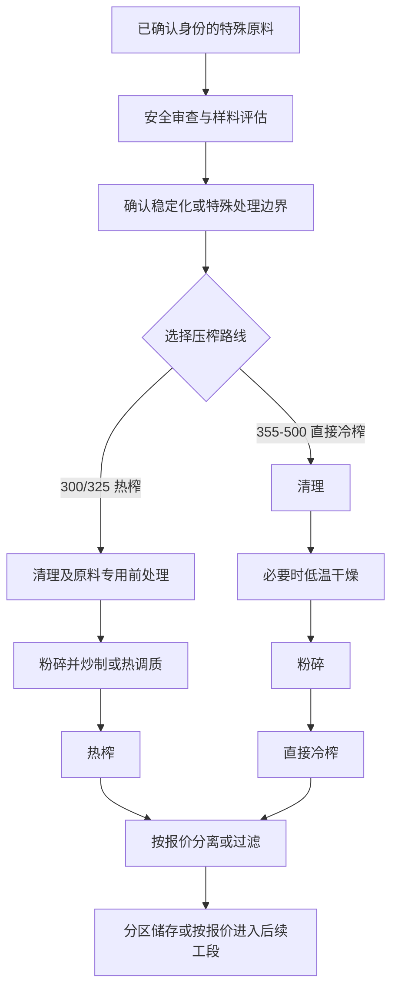

# 其他特殊油料解决方案

## 采购范围

特殊油料不能只按名称归为同一工艺。米糠、玉米胚芽、蓖麻籽、辣椒籽和其他副产物在新鲜度、粒度、生物或化学风险、稳定化要求、过滤负荷、产品用途和法律属性上差异明显，生产线和厂家价格必须从实际原料及目的地要求出发。

本页不预填含油率、出油率、单批装料、产能、投资额、运行时长或产品等级。原料是否适合压榨、设备配置和验收数值，都需要代表性样料、书面试验方法和签字报价或合同支持。

## 原料差异

| 特殊原料 | 需要确认的差异 | 前处理与安全边界 |
| --- | --- | --- |
| 米糠 | 明确是米糠而非稻壳，并说明碾米来源、新鲜度、稳定化历史、水分、细粉、酸败状态和过滤负荷 | 压榨前的稳定化和储存时效必须分配责任；设备厂家不默认来料已完成稳定化 |
| 玉米胚芽 | 胚芽纯度、残余淀粉或纤维、水分、干燥历史、储存及食品或工业用途 | 清选、必要时低温干燥、粉碎、压榨、过滤和后续精炼应分别列项 |
| 蓖麻籽 | 籽料状态、壳、成分、SDS、人员暴露、有毒饼粕、清洗和工业油规格 | 除非有资质责任方另行书面确认，应按专用非食品项目管理；密闭、饼粕处理、脱毒和处置均不默认包含 |
| 辣椒籽 | 残余果肉、辣椒素类物质、气味、粉尘、水分和交叉污染 | 确认清选、通风、个体防护责任、专用接触件或清洗，以及食品或工业产品规格 |
| 其他非常规种籽或副产物 | 准确身份、来源工艺、污染物、腐蚀性、溶剂或化学处理历史和法律属性 | 未审查安全资料、代表性样料、产品目标和处置路径前，不进行机型选择 |

一种特殊原料的结果不能套用于另一种，常用名称也不能替代批次资料。

## 机型路线与前处理边界

| 路线 | 机型 | 必须明确的工艺顺序 | 使用边界 |
| --- | --- | --- | --- |
| 热榨 | 300/325 系列 | 清理并完成原料专用安全或稳定化步骤，粉碎，炒制或热调质后压榨 | 侧重需要热处理且经确认适合的原料；加热程序由试料确定 |
| 直接冷榨 | 355-500 系列 | 清理，样料确有需要时低温干燥，粉碎后直接冷榨 | 粉碎与压榨之间不预设炒制、蒸炒或蒸煮；稳定化或脱毒如有需要，应作为独立书面边界 |

```mermaid
flowchart TD
    A[已确认身份的特殊原料] --> B[安全审查与样料评估]
    B --> C[确认稳定化或特殊处理边界]
    C --> D{选择压榨路线}
    D -->|300/325 热榨| E[清理及原料专用前处理]
    E --> F[粉碎并炒制或热调质]
    F --> G[热榨]
    D -->|355-500 直接冷榨| H[清理]
    H --> I[必要时低温干燥]
    I --> J[粉碎]
    J --> K[直接冷榨]
    G --> L[按报价分离或过滤]
    K --> L
    L --> M[分区储存或按报价进入后续工段]
```

稳定化、脱毒、粉尘控制、通风、专用清洗、精炼、浸出、灌装、公用工程、实验室检测以及危险饼粕或废弃物处理均不默认包含。报价必须写明设备、方法、责任方和验收要求。

## 样料条件与试验记录

寄送前应书面确认运输是否合法、样料数量、SDS 或成分文件、包装、报关、试料费用、清洗和处置费用、耗材、退回及废弃物路径。无法确认身份、安全或处置方式的样料，可以不进入试验。

样料资料至少说明：

- 常用名、技术名称及适用时的植物来源、供应商、产地、批次、生产日期和来源工艺
- 种籽、胚芽、米糠、果仁、粉体、颗粒或其他形态，以及水分、粒度分布、堆积与流动、杂质和如有的实验室含油率
- 新鲜度、储存温度、稳定化、干燥、加热、溶剂、化学或发酵历史
- SDS、已知毒性成分、过敏原、腐蚀性、粉尘、气味和禁止交叉接触要求
- 食品、饲料、化妆品、保健品、化工、润滑或其他工业用途
- 油、饼、滤液、排放、废水、清洗、储存和处置规格

试料记录应写明实际前处理、净投入、水分、粒度、温度过程、压力程序、完整周期、各收集组分、饼或残渣、损耗、过滤口径、清洗观察、暴露控制和实验室方法。产能属于试料和整线平衡结果，不是分类页面承诺。

## 厂家报价设备清单

特殊油料生产线可按项目选择：

- 原料接收、身份核对、取样和隔离接口
- 按物料选择的清选、筛理、分离、除尘或密闭设备
- 仅在单独设计和验收后列入的稳定化或其他专用前处理
- 355-500 直接冷榨路线在样料需要时配置的低温干燥设备
- 按物料试验选择的粉碎设备
- 经确认适用于 300/325 热榨路线的炒制或热调质设备
- 选定压榨机、液压单元、相容接触件、密封件、防护和控制
- 油或液体收集、沉降、输送、过滤和分区储存
- 饼粕、细粉、废水、排放、清洗和废弃物接口
- 电控柜、文件、图纸、约定备件和安装接口
- 另行报价的精炼、灌装、实验室、公用工程、浸出或包装系统

设备清单应区分食品接触和非食品用途，并注明专用部件或换料限制。

## 报价输入与价格口径

为了获得厂家价格和可比采购报价，请提供：

- 准确原料身份、来源工艺、样料状态、安全资料和全部计划物料
- 热榨或直接冷榨路线及目标产品用途
- 目标产能、批次或班次、季节供应、隔离、清洗和换料政策
- 项目国家与城市、场地属性、布局、进场、承载、吊装、通风和废弃物路径
- 电力、冷热源、水、压缩空气、抽排风、排水和处理设施
- 接触材质、密封、过滤、储存、精炼、灌装、包装和密闭要求
- 产品与工厂标准、实验室方法、文件、第三方检验和验收计划
- 币种、贸易术语、交货点、出口包装、运保、税费、调试、培训和备件要求
- 需要比较不同生产线边界时的预算区间

报价应分别列出压榨机、前处理、过滤、安全系统、后续设备、文件、验收测试、交付、调试和售后价格。投资测算应使用采购方提供的当地原料、产品、人工、能耗、合规、物流、税费、融资、清洗和处置成本。

## FAT 与 SAT

### FAT 工厂验收

FAT 必须基于批准样料和书面安全审查。协议应覆盖设备身份、相容接触件、报价内防护与控制、空载和带料运行、前处理、物料平衡、完整周期、温度记录、各收集组分、过滤、暴露控制、清洗、废弃物处理、取样、文件和验收标准。试料、专用清洗、防护用品、分析、处置和重复测试的费用应事先分配。

### SAT 现场验收

SAT 应确认场地属性与就绪条件、公用工程、通风和废弃物设施、安装责任、现场物料与 FAT 样料的一致性、受训人员、完整工艺运行、取样与实验室对比、清洗、追溯和问题关闭。差旅、签证、当地人工、吊装、住宿、耗材、第三方服务、废弃物处置和再次到场只有书面列项并计价后才属于范围。

## 合规与售后书面确认

采购方必须说明目的地和产品用途。合同应分配机械与电气安全、适用时的食品接触、化学品和 SDS、人员暴露、过敏原、有毒饼粕、排放、废水、废弃物分类、产品标准、标签、进出口文件和第三方实验室检测责任。

适用认证与标准必须按项目逐项核验，设备清单本身不附带国家、出口、食品、有机、化妆品、药品或工业合规结论。证书和报告应核对签约主体、工厂、机型、工艺、产品、有效状态和目的地；压榨配置不能证明特殊油品合法或合规。

售后条款应写明质保起算与范围、适用时的原料或腐蚀排除项、支持渠道和响应时段、远程与现场边界、人工和差旅费用、专用配件识别、价格和交期确认、耗材、清洗维护、说明书和培训。未写入合同的服务不视为包含。

## 联系我们

如需特殊油料设备采购、厂家价格、生产线设计或书面商务报价，请联系技术与商务团队：

- **电话**: +86 19906365856
- **邮箱**: gavin@oil-pressing-machine.com
- **地址**: 山东省潍坊市青州市开发区益能街5888号

## 相关链接

- [解决方案总览](/zh/solutions/)
- [米糠（米糠油）解决方案](/zh/solutions/rice-bran)
- [玉米胚芽（玉米胚芽油）解决方案](/zh/solutions/corn-germ)
- [蓖麻籽（蓖麻油）解决方案](/zh/solutions/castor-seed)
- [500系列液压榨油机](/zh/products/500)
- [联系我们获取方案](/zh/contact/)
- [English Page](/en/solutions/special-oils)

## 获取价格/报价

提交原料身份与安全文件、代表性样料记录、工艺路线、目标生产安排、现场条件、目的地要求、设备边界和商务条款后，厂家报价可分别列出工艺、安全、交付、验收、合规文件和售后成本。

- [获取价格/报价](/zh/contact/)

<!-- quote-cta -->
